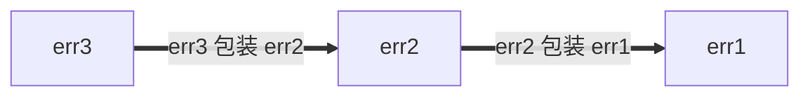

# Go 风格最佳实践

https://jqknono.github.io/styleguide/go/best-practices

[概览](index) | [指南](guide) | [决策](decisions) |
[最佳实践](best-practices)

**注意：** 这是概述 Google Go 风格的一系列文档的一部分。本文档**既非[规范性](index#normative)也非[权威性](index#canonical)**，是[核心风格指南](guide)的辅助文档。有关更多信息，请参阅[概览](index#about)。

## 关于

本文件记录了**如何最佳应用 Go 风格指南的指导**。这些指导适用于常见且频繁出现的情况，但可能不适用于所有情况。在可能的情况下，会讨论多种替代方法，并探讨决定何时应用或不应用这些方法的考虑因素。

有关完整的风格指南文档集，请参阅[概览](index#about)。

## 命名

### 函数和方法名称

#### 避免重复

在为函数或方法选择名称时，请考虑名称将在何种上下文中被阅读。请考虑以下建议，以避免在调用点出现过多的[重复](decisions#repetition)：

*   通常可以从函数和方法名称中省略以下内容：

    *   输入和输出的类型（当没有冲突时）
    *   方法接收者的类型
    *   输入或输出是否为指针

*   对于函数，不要[重复包名](decisions#repetitive-with-package)。

    ```go
    // 不好：
    package yamlconfig

    func ParseYAMLConfig(input string) (*Config, error)
    ```

    ```go
    // 好：
    package yamlconfig

    func Parse(input string) (*Config, error)
    ```

*   对于方法，不要重复方法接收者的名称。

    ```go
    // 不好：
    func (c *Config) WriteConfigTo(w io.Writer) (int64, error)
    ```

    ```go
    // 好：
    func (c *Config) WriteTo(w io.Writer) (int64, error)
    ```

*   不要重复作为参数传递的变量名称。

    ```go
    // 不好：
    func OverrideFirstWithSecond(dest, source *Config) error
    ```

    ```go
    // 好：
    func Override(dest, source *Config) error
    ```

*   不要重复返回值的名称和类型。

    ```go
    // 不好：
    func TransformYAMLToJSON(input *Config) *jsonconfig.Config
    ```

    ```go
    // 好：
    func Transform(input *Config) *jsonconfig.Config
    ```

当需要区分名称相似的函数时，可以接受包含额外信息。

```go
// 好：
func (c *Config) WriteTextTo(w io.Writer) (int64, error)
func (c *Config) WriteBinaryTo(w io.Writer) (int64, error)
```

#### 命名惯例

在为函数和方法选择名称时，还有一些其他常见的惯例：

*   返回某些东西的函数应使用名词样的名称。

    ```go
    // 好：
    func (c *Config) JobName(key string) (value string, ok bool)
    ```

    由此推论，函数和方法名称应[避免使用 `Get` 前缀](decisions#getters)。

    ```go
    // 不好：
    func (c *Config) GetJobName(key string) (value string, ok bool)
    ```

*   执行某些操作的函数应使用动词样的名称。

    ```go
    // 好：
    func (c *Config) WriteDetail(w io.Writer) (int64, error)
    ```

*   仅因涉及的类型不同而相同的函数，应在名称末尾包含类型的名称。

    ```go
    // 好：
    func ParseInt(input string) (int, error)
    func ParseInt64(input string) (int64, error)
    func AppendInt(buf []byte, value int) []byte
    func AppendInt64(buf []byte, value int64) []byte
    ```

    如果有一个明确的“主要”版本，可以从该版本的名称中省略类型：

    ```go
    // 好：
    func (c *Config) Marshal() ([]byte, error)
    func (c *Config) MarshalText() (string, error)
    ```
### 测试替身包和类型

在命名提供测试帮助器，尤其是[测试替身]的包和类型时，你可以应用几种不同的方法。一个测试替身可以是存根、假对象、模拟对象或间谍。

这些例子主要使用存根。如果你的代码使用假对象或其他类型的测试替身，请相应地更新名称。

[naming]: guide#naming
[test doubles]: https://abseil.io/resources/swe-book/html/ch13.html#basic_concepts

假设你有一个专注于提供生产代码的包，类似于以下内容：

```go
package creditcard

import (
    "errors"

    "path/to/money"
)

// ErrDeclined 表示发卡机构拒绝了这笔费用。
var ErrDeclined = errors.New("creditcard: declined")

// Card 包含信用卡的信息，如发卡机构、到期日和限额。
type Card struct {
    // 省略
}

// Service 允许你对信用卡进行操作，如对外部支付处理商进行收费、授权、退款和订阅。
type Service struct {
    // 省略
}

func (s *Service) Charge(c *Card, amount money.Money) error { /* 省略 */ }
```

<a id="naming-doubles-helper-package"></a>

#### 创建测试帮助器包

假设你想创建一个包含另一个包的测试替身的包。我们将使用上面的 `package creditcard` 作为这个例子：

一种方法是基于生产包引入一个新的 Go 包用于测试。一个安全的选择是在原始包名后面加上 `test` 这个词（"creditcard" + "test"）：

```go
// 好：
package creditcardtest
```

除非另有明确说明，否则下面各节中的所有示例都在 `package creditcardtest` 中。

<a id="naming-doubles-simple"></a>

#### 简单情况

你想为 `Service` 添加一组测试替身。因为 `Card` 实际上是一个类似于 Protocol Buffer 消息的哑数据类型，在测试中不需要特殊处理，所以不需要替身。如果你预计只为一种类型（如 `Service`）创建测试替身，你可以采用简洁的方式来命名这些替身：

```go
// 好：
import (
    "path/to/creditcard"
    "path/to/money"
)

// Stub 替代 creditcard.Service 并且不提供自己的行为。
type Stub struct{}

func (Stub) Charge(*creditcard.Card, money.Money) error { return nil }
```

这种命名方式严格优于像 `StubService` 或非常糟糕的 `StubCreditCardService` 这样的命名选择，因为基础包名及其领域类型暗示了 `creditcardtest.Stub` 是什么。

最后，如果包是用 Bazel 构建的，请确保为该包的新 `go_library` 规则标记为 `testonly`：

```build
```go
go_library(
    name = "creditcardtest",
    srcs = ["creditcardtest.go"],
    deps = [
        ":creditcard",
        ":money",
    ],
    testonly = True,
)
```

上面的方法是传统的，其他工程师会相当容易理解。

另见：

*   [Go 提示 #42：编写测试存根](https://jqknono.github.io/styleguide/go/index.html#gotip)

<a id="naming-doubles-multiple-behaviors"></a>

#### 多种测试双重行为

当一种存根不足以满足需求时（例如，你还需要一个总是失败的存根），我们建议根据它们模拟的行为来命名存根。在这里，我们将 `Stub` 重命名为 `AlwaysCharges`，并引入一个新的存根，称为 `AlwaysDeclines`：

```go
// 良好：
// AlwaysCharges 存根 creditcard.Service 并模拟成功。
type AlwaysCharges struct{}

func (AlwaysCharges) Charge(*creditcard.Card, money.Money) error { return nil }

// AlwaysDeclines 存根 creditcard.Service 并模拟拒绝充值。
type AlwaysDeclines struct{}

func (AlwaysDeclines) Charge(*creditcard.Card, money.Money) error {
    return creditcard.ErrDeclined
}
```

<a id="naming-doubles-multiple-types"></a>

#### 多种类型的多重双重

但现在假设 `package creditcard` 包含多个值得创建双重的类型，如下所示的 `Service` 和 `StoredValue`：

```go
package creditcard

type Service struct {
    // 省略
}

type Card struct {
    // 省略
}

// StoredValue 管理客户信用余额。当退货商品被记入客户的本地账户而不是由信用发行机构处理时适用。因此，它作为一个单独的服务实现。
type StoredValue struct {
    // 省略
}

func (s *StoredValue) Credit(c *Card, amount money.Money) error { /* 省略 */ }
```

在这种情况下，更明确的测试双重命名是合理的：

```go
// 良好：
type StubService struct{}

func (StubService) Charge(*creditcard.Card, money.Money) error { return nil }

type StubStoredValue struct{}

func (StubStoredValue) Credit(*creditcard.Card, money.Money) error { return nil }
```

<a id="naming-doubles-local-variables"></a>

#### 测试中的本地变量

当测试中的变量引用双重时，选择一个名称，使其与基于上下文的其他生产类型最清晰地区分开来。考虑一些你想要测试的生产代码：

```go
package payment

import (
    "path/to/creditcard"
    "path/to/money"
)

type CreditCard interface {
    Charge(*creditcard.Card, money.Money) error
}

type Processor struct {
    CC CreditCard
}

var ErrBadInstrument = errors.New("payment: 工具无效或已过期")

func (p *Processor) Process(c *creditcard.Card, amount money.Money) error {
    if c.Expired() {
        return ErrBadInstrument
    }
    return p.CC.Charge(c, amount)
}
```

在测试中，称为“间谍”的 `CreditCard` 测试双重与生产类型并列，因此在名称前加上前缀可能会提高清晰度。

```go
// 良好：
package payment

import "path/to/creditcardtest"

func TestProcessor(t *testing.T) {
    var spyCC creditcardtest.Spy
    proc := &Processor{CC: spyCC}

    // 声明省略：card 和 amount
    if err := proc.Process(card, amount); err != nil {
        t.Errorf("proc.Process(card, amount) = %v, want nil", err)
    }

    charges := []creditcardtest.Charge{
        {Card: card, Amount: amount},
    }

    if got, want := spyCC.Charges, charges; !cmp.Equal(got, want) {
        t.Errorf("spyCC.Charges = %v, want %v", got, want)
    }
}
```

这比名称没有前缀时更清晰。

```go
// 不好：
package payment

import "path/to/creditcardtest"

func TestProcessor(t *testing.T) {
    var cc creditcardtest.Spy

    proc := &Processor{CC: cc}

    // 声明省略：card 和 amount
    if err := proc.Process(card, amount); err != nil {
        t.Errorf("proc.Process(card, amount) = %v, want nil", err)
    }

    charges := []creditcardtest.Charge{
        {Card: card, Amount: amount},
    }

    if got, want := cc.Charges, charges; !cmp.Equal(got, want) {
        t.Errorf("cc.Charges = %v, want %v", got, want)
    }
}
```

<a id="shadowing"></a>
### 变量遮蔽

**注意：** 本解释使用了两个非正式术语，*覆盖*和*遮蔽*。它们不是Go语言规范中的官方概念。

像许多编程语言一样，Go有可变变量：对变量进行赋值会改变其值。

```go
// 良好：
func abs(i int) int {
    if i < 0 {
        i *= -1
    }
    return i
}
```

当使用带有`:=`操作符的[短变量声明]时，在某些情况下不会创建新变量。我们可以称之为*覆盖*。当不再需要原始值时，这样做是可以的。

```go
// 良好：
// innerHandler 是某个请求处理程序的辅助函数，它本身会向其他后端发出请求。
func (s *Server) innerHandler(ctx context.Context, req *pb.MyRequest) *pb.MyResponse {
    // 无条件地为请求处理的这一部分设置截止时间上限。
    ctx, cancel := context.WithTimeout(ctx, 3*time.Second)
    defer cancel()
    ctxlog.Info(ctx, "在内部请求中设置了截止时间上限")

    // 此处代码无法再访问原始上下文。
    // 如果在编写此代码时预期即使代码扩展，也没有任何操作应该合法地使用调用者提供的（可能无界的）原始上下文，这是良好的风格。

    // ...
}
```

然而，在新作用域中使用短变量声明时要小心：这会引入一个新变量。我们可以称之为*遮蔽*原始变量。块结束后的代码引用的是原始变量。以下是尝试有条件地缩短截止时间的错误尝试：

```go
// 错误：
func (s *Server) innerHandler(ctx context.Context, req *pb.MyRequest) *pb.MyResponse {
    // 尝试有条件地设置截止时间上限。
    if *shortenDeadlines {
        ctx, cancel := context.WithTimeout(ctx, 3*time.Second)
        defer cancel()
        ctxlog.Info(ctx, "在内部请求中设置了截止时间上限")
    }

    // 错误：此处的"ctx"再次表示调用者提供的上下文。
    // 上述错误代码能够编译，因为ctx和cancel都在if语句内部使用。

    // ...
}
```

代码的正确版本可能是：

```go
// 良好：
func (s *Server) innerHandler(ctx context.Context, req *pb.MyRequest) *pb.MyResponse {
    if *shortenDeadlines {
        var cancel func()
        // 注意使用简单赋值，=而不是:=。
        ctx, cancel = context.WithTimeout(ctx, 3*time.Second)
        defer cancel()
        ctxlog.Info(ctx, "在内部请求中设置了截止时间上限")
    }
    // ...
}
```

在我们称之为覆盖的情况下，因为没有新变量，所以被赋值的类型必须与原始变量的类型匹配。在遮蔽的情况下，引入了一个全新的实体，因此它可以具有不同的类型。有意的遮蔽可能是一种有用的做法，但如果使用新的名称能提高[清晰度](guide#clarity)，你总是可以这样做。

在除非常小的作用域之外，使用与标准包同名的变量不是一个好主意，因为这会使该包中的自由函数和值无法访问。相反，在为你的包选择名称时，应避免那些可能需要[导入重命名](decisions#import-renaming)或在客户端侧造成遮蔽其他良好变量名称的名称。

```go
// 错误：
func LongFunction() {
    url := "https://example.com/"
    // 糟糕，现在我们无法在下面的代码中使用net/url。
}
```

[短变量声明]: https://go.dev/ref/spec#Short_variable_declarations

<a id="util-packages"></a>

### 工具包

Go包在`package`声明中指定了一个名称，与导入路径分开。包名称对可读性的影响比路径更大。

Go包名称应[与包提供的内容相关](decisions#package-names)。仅将包命名为`util`、`helper`、`common`或类似的名称通常是一个糟糕的选择（虽然可以将其用作名称的一部分）。不具信息性的名称使代码更难阅读，如果使用得太广泛，它们可能会导致不必要的[导入冲突](decisions#import-renaming)。

相反，请考虑调用点的外观。

```go
// 良好：
db := spannertest.NewDatabaseFromFile(...)

_, err := f.Seek(0, io.SeekStart)

b := elliptic.Marshal(curve, x, y)
```

即使不知道导入列表（`cloud.google.com/go/spanner/spannertest`、`io`和`crypto/elliptic`），你也能大致了解这些操作的作用。如果使用不太集中的名称，这些可能会读作：

```go
// 错误：
db := test.NewDatabaseFromFile(...)

_, err := f.Seek(0, common.SeekStart)

b := helper.Marshal(curve, x, y)
```

<a id="package-size"></a>
## 包大小

如果你在问自己 Go 包应该有多大，以及是否应该将相关的类型放在同一个包中还是分成不同的包，一个好的起点是阅读 [Go 博客关于包名称的文章][blog-pkg-names]。尽管文章标题是关于命名，但内容不仅仅是命名。它包含了一些有用的提示，并引用了几篇有用的文章和演讲。

这里还有一些其他的考虑和注意事项。

用户在查看包的 [godoc] 时，会在一个页面上看到该包的内容，包中提供的类型导出的任何方法都会按类型分组。Godoc 还会将构造函数与它们返回的类型一起分组。如果 *客户端代码* 可能需要两种不同类型的数值来相互交互，将它们放在同一个包中对用户来说可能更方便。

包内的代码可以访问包中的未导出标识符。如果你有一些实现上紧密耦合的相关类型，将它们放在同一个包中可以让你实现这种耦合，而不会用这些细节污染公共 API。测试这种耦合的一个好方法是想象一个假设的用户使用两个包的情况，其中这两个包涵盖了密切相关的主题：如果用户必须导入这两个包才能以任何有意义的方式使用它们，那么将它们合并在一起通常是正确的做法。标准库通常很好地展示了这种范围和分层。

尽管如此，将整个项目放在一个包中可能会使该包变得太大。当某事物在概念上是独立的时，给它一个自己的小包可以使其更易于使用。包的短名称（客户端所知的）与导出的类型名称一起构成一个有意义的标识符：例如 `bytes.Buffer`，`ring.New`。[博客文章][blog-pkg-names] 中有更多示例。

Go 风格对文件大小比较灵活，因为维护者可以在不影响调用者的情况下将包内的代码从一个文件移动到另一个文件。但作为一般指导原则：通常不建议在一个文件中包含数千行代码，或者有许多小文件。不像其他一些语言那样有“一个类型，一个文件”的惯例。作为经验法则，文件应该足够集中，以便维护者能够判断某个内容在哪个文件中，并且文件应该足够小，以便于查找。标准库通常将大型包拆分为多个源文件，按文件分组相关代码。[包 `bytes`] 的源代码是一个很好的例子。具有长包文档的包可以选择专门使用一个名为 `doc.go` 的文件，该文件包含[包文档](decisions#package-comments)、包声明和其他内容，但这不是必需的。

在 Google 代码库和使用 Bazel 的项目中，Go 代码的目录布局与开源 Go 项目不同：你可以在一个目录中拥有多个 `go_library` 目标。如果你期望将来开源你的项目，给每个包一个自己的目录是一个很好的理由。

另见：

*   [测试双包](#naming-doubles)

[blog-pkg-names]: https://go.dev/blog/package-names
[包 `bytes`]: https://go.dev/src/bytes/
[godoc]: https://pkg.go.dev/

<a id="imports"></a>

## 导入

<a id="import-protos"></a>

### Protos 和 stubs

由于 Proto 库导入的跨语言性质，它们的处理方式与标准 Go 导入不同。重命名 proto 导入的惯例基于生成包的规则：

*   `pb` 后缀通常用于 `go_proto_library` 规则。
*   `grpc` 后缀通常用于 `go_grpc_library` 规则。

通常使用一个或两个字母的前缀：

```go
// 好：
import (
    fspb "path/to/package/foo_service_go_proto"
    fsgrpc "path/to/package/foo_service_go_grpc"
)
```

如果一个包只使用一个 proto，或者该包与该 proto 紧密相关，可以省略前缀：

```go
import (
    pb "path/to/package/foo_service_go_proto"
    grpc "path/to/package/foo_service_go_grpc"
)
```

如果 proto 中的符号是通用的或不够自描述，或者用首字母缩写缩短包名不够清晰，可以使用一个短词作为前缀：

```go
// 好：
import (
    mapspb "path/to/package/maps_go_proto"
)
```

在这种情况下，`mapspb.Address` 可能比 `mpb.Address` 更清晰，如果相关代码与地图没有明显的关联。

<a id="import-order"></a>
### 导入顺序

导入通常按以下两个（或更多）块分组，按顺序排列：

1. 标准库导入（例如 `"fmt"`）
2. 项目导入（例如 `/path/to/somelib`）
3. （可选）Protobuf 导入（例如 `fpb "path/to/foo_go_proto"`）
4. （可选）副作用导入（例如 `_ "path/to/package"`）

如果文件中没有上述可选类别之一的分组，则相关导入将包含在项目导入组中。

任何清晰易懂的导入分组方式通常都是可以接受的。例如，一个团队可以选择将 gRPC 导入与 protobuf 导入分开。

> **注意：** 对于仅维护两个必需组的代码（一组为标准库，另一组为所有其他导入），`goimports` 工具生成的输出与此指导一致。
>
> 然而，`goimports` 对必需组之外的组一无所知；可选组容易被工具破坏。当使用可选组时，作者和审阅者都需要注意，以确保分组保持合规。
>
> 两种方法都可以，但不要让导入部分处于不一致的、部分分组的状态。

<a id="error-handling"></a>

## 错误处理

在 Go 中，[错误是值]；它们由代码创建并由代码消费。错误可以：

* 转换为供人类显示的诊断信息
* 由维护者使用
* 由最终用户解释

错误消息也会出现在各种不同的界面上，包括日志消息、错误转储和渲染的用户界面。

处理（产生或消费）错误的代码应该有意为之。忽略或盲目传播错误返回值可能很诱人。然而，总是值得考虑当前调用框架中的函数是否处于最有效处理错误的位置。这是一个很大的话题，很难给出分类建议。使用你的判断，但请记住以下考虑因素：

* 在创建错误值时，决定是否赋予它任何[结构](#error-structure)。
* 在处理错误时，考虑[添加信息](#error-extra-info)，这些信息是你拥有的，但调用者和/或被调用者可能没有。
* 另见关于[错误日志](#error-logging)的指导。

虽然通常不应忽略错误，但当编排相关操作时，一个合理的例外是通常只有第一个错误是有用的。包 [`errgroup`] 为一组可以全部失败或作为一个组取消的操作提供了一个方便的抽象。

[错误是值]: https://go.dev/blog/errors-are-values
[`errgroup`]: https://pkg.go.dev/golang.org/x/sync/errgroup

另见：

* [关于错误的 Effective Go](https://go.dev/doc/effective_go#errors)
* [Go 博客关于错误的文章](https://go.dev/blog/go1.13-errors)
* [包 `errors`](https://pkg.go.dev/errors)
* [包 `upspin.io/errors`](https://commandcenter.blogspot.com/2017/12/error-handling-in-upspin.html)
* [GoTip #89：何时使用规范状态代码作为错误](https://jqknono.github.io/styleguide/go/index.html#gotip)
* [GoTip #48：错误哨兵值](https://jqknono.github.io/styleguide/go/index.html#gotip)
* [GoTip #13：设计用于检查的错误](https://jqknono.github.io/styleguide/go/index.html#gotip)

<a id="error-structure"></a>
### 错误结构

如果调用者需要检查错误（例如，区分不同的错误条件），请提供错误值结构，以便可以以编程方式进行，而不是让调用者执行字符串匹配。此建议适用于生产代码以及关心不同错误条件的测试。

最简单的结构化错误是无参数的全局值。

```go
type Animal string

var (
    // ErrDuplicate 在此动物已被看到时发生。
    ErrDuplicate = errors.New("duplicate")

    // ErrMarsupial 因为我们在澳大利亚以外对有袋动物过敏而发生。
    // 抱歉。
    ErrMarsupial = errors.New("marsupials are not supported")
)

func process(animal Animal) error {
    switch {
    case seen[animal]:
        return ErrDuplicate
    case marsupial(animal):
        return ErrMarsupial
    }
    seen[animal] = true
    // ...
    return nil
}
```

调用者可以简单地将函数返回的错误值与已知的错误值之一进行比较：

```go
// 良好：
func handlePet(...) {
    switch err := process(an); err {
    case ErrDuplicate:
        return fmt.Errorf("feed %q: %v", an, err)
    case ErrMarsupial:
        // 尝试用朋友来恢复。
        alternate = an.BackupAnimal()
        return handlePet(..., alternate, ...)
    }
}
```

上述使用了哨兵值，其中错误必须等于（在 `==` 的意义上）预期值。在许多情况下这完全足够。如果 `process` 返回包装错误（如下所述），您可以使用 [`errors.Is`]。

```go
// 良好：
func handlePet(...) {
    switch err := process(an); {
    case errors.Is(err, ErrDuplicate):
        return fmt.Errorf("feed %q: %v", an, err)
    case errors.Is(err, ErrMarsupial):
        // ...
    }
}
```

不要尝试根据错误的字符串形式来区分错误。（有关更多信息，请参见 [Go 提示 #13：设计用于检查的错误](https://jqknono.github.io/styleguide/go/index.html#gotip)。）

```go
// 不好：
func handlePet(...) {
    err := process(an)
    if regexp.MatchString(`duplicate`, err.Error()) {...}
    if regexp.MatchString(`marsupial`, err.Error()) {...}
}
```

如果错误中包含调用者以编程方式需要的额外信息， ideally 应以结构化方式呈现。例如，[`os.PathError`] 类型被记录为将失败操作的路径名放置在结构字段中，调用者可以轻松访问。

可以根据需要使用其他错误结构，例如包含错误代码和详细字符串的项目结构。[包 `status`][status] 是一种常见的封装；如果您选择这种方法（您没有义务这样做），请使用 [规范代码]。请参见 [Go 提示 #89：何时使用规范状态代码作为错误](https://jqknono.github.io/styleguide/go/index.html#gotip)，以了解使用状态代码是否是正确的选择。

[`os.PathError`]: https://pkg.go.dev/os#PathError
[`errors.Is`]: https://pkg.go.dev/errors#Is
[`errors.As`]: https://pkg.go.dev/errors#As
[`package cmp`]: https://pkg.go.dev/github.com/google/go-cmp/cmp
[status]: https://pkg.go.dev/google.golang.org/grpc/status
[canonical codes]: https://pkg.go.dev/google.golang.org/grpc/codes

<a id="error-extra-info"></a>
### 向错误中添加信息

任何返回错误的函数都应该努力使错误值有用。通常，函数处于调用链的中间，只是传播它调用的另一个函数（甚至可能是另一个包）的错误。在这里，有机会用额外的信息注释错误，但程序员应该确保错误中包含足够的信息，而不添加重复或不相关的细节。如果你不确定，可以在开发过程中尝试触发错误条件：这是一个评估错误观察者（无论是人类还是代码）最终会得到什么的好方法。

惯例和良好的文档有帮助。例如，标准包 `os` 宣传其错误在可用时包含路径信息。这是一种有用的风格，因为获取错误的调用者不需要用他们已经提供给失败函数的信息来注释错误。

```go
// 好：
if err := os.Open("settings.txt"); err != nil {
    return err
}

// 输出：
//
// open settings.txt: no such file or directory
```

如果关于错误的*含义*有有趣的事情要说，当然可以添加。只是要考虑调用链的哪个层次最适合理解这个含义。

```go
// 好：
if err := os.Open("settings.txt"); err != nil {
    // 我们传达这个错误对我们的意义。请注意，当前函数可能执行多个可能失败的文件操作，因此这些注释也可以帮助调用者区分出了什么问题。
    return fmt.Errorf("launch codes unavailable: %v", err)
}

// 输出：
//
// launch codes unavailable: open settings.txt: no such file or directory
```

与这里的冗余信息形成对比：

```go
// 坏：
if err := os.Open("settings.txt"); err != nil {
    return fmt.Errorf("could not open settings.txt: %w", err)
}

// 输出：
//
// could not open settings.txt: open settings.txt: no such file or directory
```

在向传播的错误中添加信息时，你可以包装错误或呈现一个新的错误。使用 `fmt.Errorf` 中的 `%w` 动词包装错误允许调用者访问原始错误的数据。这在某些时候非常有用，但在其他情况下，这些细节对调用者来说具有误导性或不感兴趣。有关更多信息，请参阅[关于错误包装的博客文章](https://blog.golang.org/go1.13-errors)。包装错误还以一种不明显的方式扩展了你的包的 API 表面，如果你更改包的实现细节，这可能会导致中断。

除非你还记录（并有验证你暴露的底层错误的测试），否则最好避免使用 `%w`。如果你不期望你的调用者调用 `errors.Unwrap`、`errors.Is` 等，就不要使用 `%w`。

同样的概念适用于[结构化错误](#error-structure)，如 [`*status.Status`][status]（参见[规范代码]）。例如，如果你的服务器向后端发送格式错误的请求并收到 `InvalidArgument` 代码，则此代码*不应*传播给客户端，假设客户端没有做错任何事情。相反，向客户端返回 `Internal` 规范代码。

然而，注释错误有助于自动化日志系统保留错误的状态负载。例如，在内部函数中注释错误是合适的：

```go
// 好：
func (s *Server) internalFunction(ctx context.Context) error {
    // ...
    if err != nil {
        return fmt.Errorf("couldn't find remote file: %w", err)
    }
}
```

直接在系统边界的代码（通常是 RPC、IPC、存储等）应该使用规范错误空间报告错误。这里代码的责任是处理特定领域的错误并以规范方式表示它们。例如：

```go
// 坏：
func (*FortuneTeller) SuggestFortune(context.Context, *pb.SuggestionRequest) (*pb.SuggestionResponse, error) {
    // ...
    if err != nil {
        return nil, fmt.Errorf("couldn't find remote file: %w", err)
    }
}
```

```go
// 好：
import (
    "google.golang.org/grpc/codes"
    "google.golang.org/grpc/status"
)
func (*FortuneTeller) SuggestFortune(context.Context, *pb.SuggestionRequest) (*pb.SuggestionResponse, error) {
    // ...
    if err != nil {
        // 如果故意包装一个调用者应该解包的错误，可以使用带有 %w 动词的 fmt.Errorf。
        return nil, status.Errorf(codes.Internal, "couldn't find fortune database", status.ErrInternal)
    }
}
```

另见：

*   [错误文档惯例](#documentation-conventions-errors)

<a id="error-percent-w"></a>
### %w 在错误中的放置

建议将 `%w` 放在错误字符串的末尾。

错误可以使用
[`%w` 动词](https://blog.golang.org/go1.13-errors)包装，或者放置在实现了 `Unwrap() error` 的
[结构化错误](https://jqknono.github.io/styleguide/go/index.html#gotip) 中（例如：
[`fs.PathError`](https://pkg.go.dev/io/fs#PathError)）。

包装后的错误形成错误链：每增加一层包装，就在错误链的前端添加一个新条目。可以使用
`Unwrap() error` 方法遍历错误链。例如：

```go
err1 := fmt.Errorf("err1")
err2 := fmt.Errorf("err2: %w", err1)
err3 := fmt.Errorf("err3: %w", err2)
```

这形成了如下形式的错误链：



无论 `%w` 动词放在哪里，返回的错误总是代表错误链的前端，而 `%w` 是下一个子错误。
同样，`Unwrap() error` 总是从最新的错误遍历到最旧的错误。

然而，`%w` 动词的放置确实会影响错误链是按从新到旧、从旧到新还是两者皆非的方式打印：

```go
// 好：
err1 := fmt.Errorf("err1")
err2 := fmt.Errorf("err2: %w", err1)
err3 := fmt.Errorf("err3: %w", err2)
fmt.Println(err3) // err3: err2: err1
// err3 是一个从新到旧的错误链，打印时也是从新到旧。
```

```go
// 不好：
err1 := fmt.Errorf("err1")
err2 := fmt.Errorf("%w: err2", err1)
err3 := fmt.Errorf("%w: err3", err2)
fmt.Println(err3) // err1: err2: err3
// err3 是一个从新到旧的错误链，打印时却是从旧到新。
```

```go
// 不好：
err1 := fmt.Errorf("err1")
err2 := fmt.Errorf("err2-1 %w err2-2", err1)
err3 := fmt.Errorf("err3-1 %w err3-2", err2)
fmt.Println(err3) // err3-1 err2-1 err1 err2-2 err3-2
// err3 是一个从新到旧的错误链，打印时既不是从新到旧，也不是从旧到新。
```

因此，为了使错误文本反映错误链结构，建议将 `%w` 动词放在末尾，采用 `[...]: %w` 的形式。

<a id="error-logging"></a>
### 记录错误

函数有时需要将错误告知外部系统，而不将其传播给调用者。记录日志在这里是一个显而易见的选择；但要注意记录什么以及如何记录错误。

*   与[良好的测试失败消息]一样，日志消息应该清楚地表达出了什么问题，并通过包含相关信息来帮助维护者诊断问题。

*   避免重复。如果你返回了一个错误，通常最好不要自己记录它，而是让调用者处理。调用者可以选择记录错误，或者使用[`rate.Sometimes`]来限制记录频率。其他选项包括尝试恢复甚至[停止程序]。无论哪种情况，让调用者控制有助于避免日志泛滥。

    然而，这种方法的缺点是，任何记录都将使用调用者的行坐标来写入。

*   小心处理[PII]。许多日志接收器不适合存储敏感的最终用户信息。

*   谨慎使用`log.Error`。ERROR级别的日志记录会导致刷新，并且比较低的日志级别更昂贵。这可能会对你的代码性能产生严重影响。在决定使用错误级别还是警告级别时，请考虑最佳实践，即错误级别的消息应该是可操作的，而不仅仅是比警告“更严重”。

*   在Google内部，我们有监控系统，可以设置比写入日志文件并希望有人注意到它更有效的警报。这与标准库[包`expvar`]类似但不完全相同。

[良好的测试失败消息]: https://jqknono.github.io/styleguide/go/decisions#useful-test-failures
[停止程序]: #checks-and-panics
[`rate.Sometimes`]: https://pkg.go.dev/golang.org/x/time/rate#Sometimes
[PII]: https://en.wikipedia.org/wiki/Personal_data
[包`expvar`]: https://pkg.go.dev/expvar

<a id="vlog"></a>

#### 自定义详细级别

利用详细日志记录([`log.V`])。详细日志记录对开发和跟踪很有用。围绕详细级别建立一个惯例会很有帮助。例如：

*   在`V(1)`级别记录少量额外信息
*   在`V(2)`级别跟踪更多信息
*   在`V(3)`级别转储大型内部状态

为了最小化详细日志记录的成本，你应该确保即使`log.V`关闭时也不要意外调用昂贵的函数。`log.V`提供了两种API。更方便的一种带有这种意外开销的风险。当有疑问时，请使用稍微冗长的风格。

```go
// 良好：
for _, sql := range queries {
  log.V(1).Infof("处理 %v", sql)
  if log.V(2) {
    log.Infof("处理 %v", sql.Explain())
  }
  sql.Run(...)
}
```

```go
// 不好：
// 即使此日志未打印，sql.Explain也会被调用。
log.V(2).Infof("处理 %v", sql.Explain())
```

[`log.V`]: https://pkg.go.dev/github.com/golang/glog#V

<a id="program-init"></a>

### 程序初始化

程序初始化错误（如错误的标志和配置）应该向上传播到`main`，后者应该调用`log.Exit`并附带一个解释如何修复错误的错误信息。在这些情况下，通常不应使用`log.Fatal`，因为指向检查的堆栈跟踪可能不如人工生成的、可操作的消息有用。

<a id="checks-and-panics"></a>
### 程序检查和恐慌

如[反对恐慌的决定]中所述，标准错误处理应围绕错误返回值进行结构化。库应优先向调用者返回错误，而不是中止程序，尤其是在处理暂时性错误时。

有时需要对不变量进行一致性检查，如果违反则终止程序。一般来说，只有当不变量检查失败意味着内部状态已无法恢复时，才会这样做。在 Google 代码库中，调用 `log.Fatal` 是实现这一点的最可靠方式。在这些情况下使用 `panic` 并不可靠，因为延迟函数可能会导致死锁或进一步损坏内部或外部状态。

同样，要抵制恢复恐慌以避免崩溃的诱惑，这样做可能会导致传播损坏的状态。离恐慌越远，你对程序状态的了解就越少，程序可能持有锁或其他资源。随后，程序可能会发展出其他意外的失败模式，使问题更加难以诊断。不要试图在代码中处理意外的恐慌，而是使用监控工具来发现意外的失败，并优先修复相关错误。

**注意：** 标准的 [`net/http` 服务器]违反了这一建议，并从请求处理程序中恢复恐慌。经验丰富的 Go 工程师的共识是，这是历史上的一个错误。如果你从其他语言的应用程序服务器中抽样服务器日志，通常会发现大量未处理的大型堆栈跟踪。在你的服务器中避免这种陷阱。

[反对恐慌的决定]: https://jqknono.github.io/styleguide/go/decisions#dont-panic
[`net/http` 服务器]: https://pkg.go.dev/net/http#Server

<a id="when-to-panic"></a>

### 何时使用恐慌

标准库在 API 误用时会引发恐慌。例如，[`reflect`] 在许多情况下，当一个值的访问方式表明它被误解时，会引发恐慌。这类似于在核心语言错误上引发的恐慌，例如访问超出边界的切片元素。代码审查和测试应发现此类错误，这些错误不应出现在生产代码中。这些恐慌作为不依赖于库的不变量检查，因为标准库无法访问 Google 代码库使用的[分级 `log`] 包。

[`reflect`]: https://pkg.go.dev/reflect
[分级 `log`]: decisions#logging

另一种恐慌可能有用但不常见的情况是，作为一个包的内部实现细节，该包在调用链中始终有一个匹配的恢复。解析器和类似的深度嵌套、紧密耦合的内部函数组可以从这种设计中受益，在这种情况下，管道错误返回会增加无价值的复杂性。这种设计的关键属性是，这些恐慌永远不会跨越包边界传播，也不构成包的 API 的一部分。这通常通过顶级延迟恢复来实现，将传播的恐慌转换为在公共 API 表面上返回的错误。

当编译器无法识别不可达代码时，也会使用恐慌，例如使用像 `log.Fatal` 这样的不会返回的函数时：

```go
// 良好：
func answer(i int) string {
    switch i {
    case 42:
        return "yup"
    case 54:
        return "base 13, huh"
    default:
        log.Fatalf("Sorry, %d is not the answer.", i)
        panic("unreachable")
    }
}
```

[在解析标志之前不要调用 `log` 函数。](https://pkg.go.dev/github.com/golang/glog#pkg-overview)
如果必须在包初始化函数中（一个 `init` 或一个["必须"函数](decisions#must-functions)）终止，恐慌可以替代致命日志调用。

<a id="documentation"></a>

## 文档

<a id="documentation-conventions"></a>
### 约定

本节是对决策文档[评论]部分的补充。

以熟悉的风格记录的Go代码更易于阅读，且比未记录或记录错误的代码更不容易被误用。可运行的[示例]会出现在Godoc和代码搜索中，是解释如何使用代码的绝佳方式。

[示例]: decisions#examples

<a id="documentation-conventions-params"></a>

#### 参数和配置

并非每个参数都必须在文档中列举。这适用于：

*   函数和方法参数
*   结构体字段
*   选项的API

通过说明为什么它们有趣，来记录容易出错或不明显的字段和参数。

在下面的代码片段中，高亮的评论对读者几乎没有提供有用的信息：

```go
// 不好：
// Sprintf根据格式说明符进行格式化并返回生成的字符串。
//
// format是格式，data是插值数据。
func Sprintf(format string, data ...any) string
```

然而，下面的代码片段展示了一个与前一个类似的代码场景，其中评论说明了不明显或对读者有实质帮助的内容：

```go
// 好：
// Sprintf根据格式说明符进行格式化并返回生成的字符串。
//
// 提供的数据用于插值格式字符串。如果数据与预期的格式动词不匹配，或者数据量不满足格式规范，函数将根据上面的格式错误部分描述，将格式错误的警告内联到输出字符串中。
func Sprintf(format string, data ...any) string
```

在选择记录什么内容和记录的深度时，请考虑您的可能受众。维护者、团队新成员、外部用户，甚至是六个月后的自己，可能需要与您初次编写文档时所考虑的信息略有不同的信息。

另见：

*   [GoTip #41: 识别函数调用参数]
*   [GoTip #51: 配置模式]

[评论]: decisions#commentary
[GoTip #41: 识别函数调用参数]: https://jqknono.github.io/styleguide/go/index.html#gotip
[GoTip #51: 配置模式]: https://jqknono.github.io/styleguide/go/index.html#gotip

<a id="documentation-conventions-contexts"></a>

#### 上下文

隐含的是，取消上下文参数会中断它所提供的函数。如果函数可以返回错误，通常是`ctx.Err()`。

这一事实无需重申：

```go
// 不好：
// Run执行工作者的运行循环。
//
// 该方法将处理工作，直到上下文被取消，并相应地返回错误。
func (Worker) Run(ctx context.Context) error
```

因为这是隐含的，所以以下更好：

```go
// 好：
// Run执行工作者的运行循环。
func (Worker) Run(ctx context.Context) error
```

当上下文行为不同或不明显时，如果以下任何一项为真，则应明确记录：

*   当上下文被取消时，函数返回的错误不是`ctx.Err()`：

    ```go
    // 好：
    // Run执行工作者的运行循环。
    //
    // 如果上下文被取消，Run返回一个nil错误。
    func (Worker) Run(ctx context.Context) error
    ```

*   函数有其他可能中断它或影响生命周期的机制：

    ```go
    // 好：
    // Run执行工作者的运行循环。
    //
    // Run处理工作，直到上下文被取消或调用Stop。
    // 上下文取消在内部异步处理：run可能在所有工作停止之前返回。Stop方法是同步的，并等待运行循环中的所有操作完成。使用Stop进行优雅关闭。
    func (Worker) Run(ctx context.Context) error

    func (Worker) Stop()
    ```

*   函数对上下文生命周期、血统或附加值有特殊期望：

    ```go
    // 好：
    // NewReceiver开始接收发送到指定队列的消息。
    // 上下文不应有截止时间。
    func NewReceiver(ctx context.Context) *Receiver

    // Principal返回发起调用的方的可读名称。
    // 上下文必须附加来自security.NewContext的值。
    func Principal(ctx context.Context) (name string, ok bool)
    ```

    **警告：** 避免设计要求调用者做出此类要求（如上下文没有截止时间）的API。以上仅是如果无法避免时如何记录的示例，并非对该模式的认可。

<a id="documentation-conventions-concurrency"></a>

#### 并发

Go用户假设概念上只读的操作是安全的，可以并发使用，不需要额外的同步。

在以下Godoc中，可以安全地删除关于并发的额外说明：

```go
// Len返回缓冲区未读部分的字节数；
// b.Len() == len(b.Bytes())。
//
// 可以安全地被多个goroutine并发调用。
func (*Buffer) Len() int

然而，修改操作不被认为是安全的并发使用，需要用户考虑同步。

同样，这里可以安全地删除关于并发的额外注释：

```go
// Grow 增加缓冲区的容量。
//
// 不可以被多个goroutine并发调用。
func (*Buffer) Grow(n int)
```

如果以下任何一种情况属实，强烈建议提供文档。

*   不清楚操作是只读还是修改的：

    ```go
    // 良好：
    package lrucache

    // Lookup 从缓存中返回与键关联的数据。
    //
    // 此操作不安全用于并发使用。
    func (*Cache) Lookup(key string) (data []byte, ok bool)
    ```

    为什么？查找键时的缓存命中会在内部修改LRU缓存。这种实现方式对所有读者可能并不明显。

*   API提供了同步：

    ```go
    // 良好：
    package fortune_go_proto

    // NewFortuneTellerClient 返回一个用于FortuneTeller服务的*rpc.Client。
    // 它可以安全地被多个goroutine同时使用。
    func NewFortuneTellerClient(cc *rpc.ClientConn) *FortuneTellerClient
    ```

    为什么？Stubby提供了同步。

    **注意：** 如果API是一个类型，并且API完全提供了同步，通常只有类型定义文档说明语义。

*   API使用用户实现的类型或接口，并且接口的消费者有特定的并发要求：

    ```go
    // 良好：
    package health

    // Watcher 报告某个实体（通常是后端服务）的健康状况。
    //
    // Watcher方法可以安全地被多个goroutine同时使用。
    type Watcher interface {
        // Watch 在Watcher的状态发生变化时，向传入的通道发送true。
        Watch(changed chan<- bool) (unwatch func())

        // Health 如果被监控的实体健康，则返回nil；否则返回一个非nil错误，解释实体不健康的原因。
        Health() error
    }
    ```

    为什么？API是否可以安全地被多个goroutine使用是其契约的一部分。

<a id="documentation-conventions-cleanup"></a>

#### 清理

记录API的任何明确的清理要求。否则，调用者将无法正确使用API，导致资源泄漏和其他可能的错误。

指出由调用者负责的清理：

```go
// 良好：
// NewTicker 返回一个新的Ticker，其中包含一个通道，该通道在每次滴答后将当前时间发送到通道中。
//
// 完成后调用Stop以释放Ticker的相关资源。
func NewTicker(d Duration) *Ticker

func (*Ticker) Stop()
```

如果如何清理资源可能不清楚，请解释如何清理：

```go
// 良好：
// Get 向指定的URL发出GET请求。
//
// 当err为nil时，resp总是包含一个非nil的resp.Body。
// 调用者在从中读取完毕后应关闭resp.Body。
//
//    resp, err := http.Get("http://example.com/")
//    if err != nil {
//        // 处理错误
//    }
//    defer resp.Body.Close()
//    body, err := io.ReadAll(resp.Body)
func (c *Client) Get(url string) (resp *Response, err error)
```

另见：

*   [GoTip #110: 不要将退出与延迟混合]

[GoTip #110: 不要将退出与延迟混合]: https://jqknono.github.io/styleguide/go/index.html#gotip

<a id="documentation-conventions-errors"></a>

#### 错误

记录函数返回给调用者的重要错误哨兵值或错误类型，以便调用者可以预期他们在代码中可以处理的条件类型。

```go
// 良好：
package os

// Read 从File中读取最多len(b)个字节，并将它们存储在b中。它返回读取的字节数和遇到的任何错误。
//
// 在文件末尾，Read返回0, io.EOF。
func (*File) Read(b []byte) (n int, err error) {
```

当函数返回特定错误类型时，正确注明错误是否为指针接收者：

```go
// 良好：
package os

type PathError struct {
    Op   string
    Path string
    Err  error
}

// Chdir 将当前工作目录更改为指定的目录。
//
// 如果有错误，它将是*PathError类型。
func Chdir(dir string) error {
```

记录返回值是否为指针接收者，使调用者能够正确使用[`errors.Is`]、[`errors.As`]和[`package cmp`]比较错误。这是因为非指针值与指针值不等同。

**注意：** 在`Chdir`示例中，返回类型写为`error`，而不是`*PathError`，这是由于[空接口值的工作方式](https://go.dev/doc/faq#nil_error)。

在[包的文档](decisions#package-comments)中记录整体错误惯例，当行为是
适用于包中发现的大多数错误：

```go
// 良好：
// 包 os 提供了一个与平台无关的操作系统功能接口。
//
// 通常，错误中可以获得更多信息。例如，如果一个调用失败了，比如 Open 或 Stat，
// 错误在打印时会包含失败的文件名，并且类型为 *PathError，可以解包以获取更多信息。
package os
```

这些方法的深思熟虑应用可以轻松地为错误添加[额外信息](#error-extra-info)，并帮助调用者避免添加冗余注释。

另见：

*   [Go 提示 #106：错误命名约定](https://jqknono.github.io/styleguide/go/index.html#gotip)
*   [Go 提示 #89：何时使用规范状态码作为错误](https://jqknono.github.io/styleguide/go/index.html#gotip)

<a id="documentation-preview"></a>

### 预览

Go 具有一个[文档服务器](https://pkg.go.dev/golang.org/x/pkgsite/cmd/pkgsite)。建议在代码审查过程之前和期间预览代码生成的文档。这有助于验证[godoc 格式]是否正确渲染。

[godoc 格式]: #godoc-formatting

<a id="godoc-formatting"></a>

### Godoc 格式

[Godoc] 提供了一些特定的语法来[格式化文档]。

*   需要空行来分隔段落：

    ```go
    // 良好：
    // LoadConfig 从指定文件中读取配置。
    //
    // 有关配置文件格式详情，请参见 some/shortlink。
    ```

*   测试文件可以包含[可运行示例]，这些示例会在 godoc 中显示为附件文档：

    ```go
    // 良好：
    func ExampleConfig_WriteTo() {
      cfg := &Config{
        Name: "example",
      }
      if err := cfg.WriteTo(os.Stdout); err != nil {
        log.Exitf("写入配置失败：%s", err)
      }
      // 输出：
      // {
      //   "name": "example"
      // }
    }
    ```

*   通过额外缩进两格，可以逐字格式化行：

    ```go
    // 良好：
    // Update 在原子事务中运行函数。
    //
    // 这通常与匿名 TransactionFunc 一起使用：
    //
    //   if err := db.Update(func(state *State) { state.Foo = bar }); err != nil {
    //     //...
    //   }
    ```

    然而，通常将代码放在可运行示例中而不是包含在注释中更为合适。

    这种逐字格式化可以用于 godoc 不原生支持的格式，如列表和表格：

    ```go
    // 良好：
    // LoadConfig 从指定文件中读取配置。
    //
    // LoadConfig 对以下键有特殊处理：
    //   "import" 将使此配置从指定文件继承。
    //   "env" 如果存在，将填充系统环境。
    ```

*   以大写字母开头、除括号和逗号外不包含标点符号、后跟另一段落的单行会被格式化为标题：

    ```go
    // 良好：
    // 以下行被格式化为标题。
    //
    // 使用标题
    //
    // 标题带有自动生成的锚标记，便于链接。
    ```

[Godoc]: https://pkg.go.dev/
[格式化文档]: https://go.dev/doc/comment
[可运行示例]: decisions#examples

<a id="signal-boost"></a>

### 信号增强

有时一行代码看起来很常见，但实际上并非如此。一个最好的例子是 `err == nil` 检查（因为 `err != nil` 更为常见）。以下两个条件检查很难区分：

```go
// 良好：
if err := doSomething(); err != nil {
    // ...
}
```

```go
// 不好：
if err := doSomething(); err == nil {
    // ...
}
```

你可以通过添加注释来“增强”条件的信号：

```go
// 良好：
if err := doSomething(); err == nil { // 如果没有错误
    // ...
}
```

注释会引起人们对条件差异的注意。

<a id="vardecls"></a>

## 变量声明

<a id="vardeclinitialization"></a>

### 初始化

为了保持一致性，在用非零值初始化新变量时，优先使用 `:=` 而不是 `var`。

```go
// 良好：
i := 42
```

```go
// 不好：
var i = 42
```

<a id="vardeclzero"></a>
### 使用零值声明变量

以下声明使用了[零值]：

```go
// 好：
var (
    coords Point
    magic  [4]byte
    primes []int
)
```

[零值]: https://golang.org/ref/spec#The_zero_value

当你想表达一个准备好稍后使用的空值时，你应该使用零值来声明变量。使用带有显式初始化的复合字面量可能会显得笨拙：

```go
// 不好：
var (
    coords = Point{X: 0, Y: 0}
    magic  = [4]byte{0, 0, 0, 0}
    primes = []int(nil)
)
```

零值声明的常见应用是在反序列化时使用变量作为输出：

```go
// 好：
var coords Point
if err := json.Unmarshal(data, &coords); err != nil {
```

当你需要一个指针类型的变量时，以下形式使用零值也是可以的：

```go
// 好：
msg := new(pb.Bar) // 或者 "&pb.Bar{}"
if err := proto.Unmarshal(data, msg); err != nil {
```

如果你在结构体中需要一个锁或其他[不可复制的字段](decisions#copying)，你可以将其设为值类型以利用零值初始化。这意味着包含类型现在必须通过指针而不是值来传递。类型上的方法必须使用指针接收者。

```go
// 好：
type Counter struct {
    // 这个字段不必是 "*sync.Mutex"。然而，
    // 用户现在必须在它们之间传递 *Counter 对象，而不是 Counter。
    mu   sync.Mutex
    data map[string]int64
}

// 注意这必须是指针接收者以防止复制。
func (c *Counter) IncrementBy(name string, n int64)
```

对于包含此类不可复制字段的复合类型（如结构体和数组），使用值类型作为局部变量是可以接受的。然而，如果函数返回该复合类型，或者如果对它的所有访问最终都需要获取地址，最好一开始就将变量声明为指针类型。同样，protobufs 也应该声明为指针类型。

```go
// 好：
func NewCounter(name string) *Counter {
    c := new(Counter) // "&Counter{}" 也行。
    registerCounter(name, c)
    return c
}

var msg = new(pb.Bar) // 或者 "&pb.Bar{}"。
```

这是因为 `*pb.Something` 满足 [`proto.Message`] 而 `pb.Something` 不满足。

```go
// 不好：
func NewCounter(name string) *Counter {
    var c Counter
    registerCounter(name, &c)
    return &c
}

var msg = pb.Bar{}
```

[`proto.Message`]: https://pkg.go.dev/google.golang.org/protobuf/proto#Message

> **重要提示：** 映射类型在修改之前必须显式初始化。然而，从零值映射读取是完全没问题的。
>
> 对于映射和切片类型，如果代码特别注重性能，并且你提前知道大小，请参阅[大小提示](#vardeclsize)部分。

<a id="vardeclcomposite"></a>

### 复合字面量

以下是[复合字面量]声明：

```go
// 好：
var (
    coords   = Point{X: x, Y: y}
    magic    = [4]byte{'I', 'W', 'A', 'D'}
    primes   = []int{2, 3, 5, 7, 11}
    captains = map[string]string{"Kirk": "James Tiberius", "Picard": "Jean-Luc"}
)
```

当你知道初始元素或成员时，你应该使用复合字面量来声明一个值。

相比之下，使用复合字面量来声明空值或无成员值可能会比[零值初始化](#vardeclzero)显得视觉上嘈杂。

当你需要一个指向零值的指针时，你有两种选择：空复合字面量和 `new`。两者都很好，但 `new` 关键字可以提醒读者，如果需要非零值，复合字面量将不起作用：

```go
// 好：
var (
  buf = new(bytes.Buffer) // 非空的 Buffers 通过构造函数初始化。
  msg = new(pb.Message) // 非空的 proto 消息通过构建器初始化或逐个设置字段。
)
```

[复合字面量]: https://golang.org/ref/spec#Composite_literals

<a id="vardeclsize"></a>
### 大小提示

以下是利用大小提示进行预分配容量的声明：

```go
// 良好：
var (
    // 目标文件系统的首选缓冲区大小：st_blksize。
    buf = make([]byte, 131072)
    // 通常每次运行处理8-10个元素（16是一个安全的假设）。
    q = make([]Node, 0, 16)
    // 每个分片处理shardSize（通常为32000+）个元素。
    seen = make(map[string]bool, shardSize)
)
```

大小提示和预分配是重要步骤，**当结合对代码及其集成的实证分析时**，可以创建性能敏感和资源高效的代码。

大多数代码不需要大小提示或预分配，可以让运行时根据需要增长切片或映射。当最终大小已知时（例如，在映射和切片之间转换时），预分配是可以接受的，但这不是可读性的要求，在小案例中可能不值得增加混乱。

**警告：**预分配超过所需的内存可能会浪费舰队中的内存，甚至损害性能。如果有疑问，请参阅[Go技巧#3：基准测试Go代码]，并默认使用[零初始化](#vardeclzero)或[复合字面量声明](#vardeclcomposite)。

[Go技巧#3：基准测试Go代码]: https://jqknono.github.io/styleguide/go/index.html#gotip

<a id="decl-chan"></a>

### 通道方向

在可能的情况下，指定[通道方向]。

```go
// 良好：
// sum计算所有值的总和。它从通道读取，直到通道关闭。
func sum(values <-chan int) int {
    // ...
}
```

这可以防止在没有指定的情况下可能出现的随意编程错误：

```go
// 不好：
func sum(values chan int) (out int) {
    for v := range values {
        out += v
    }
    // 要到达这段代码，values必须已经关闭，这意味着第二次关闭会触发panic。
    close(values)
}
```

当指定方向时，编译器可以捕获这种简单的错误。它还有助于向类型传达一定程度的所有权。

另见Bryan Mills的演讲“重新思考经典并发模式”：[幻灯片][rethinking-concurrency-slides] [视频][rethinking-concurrency-video]。

[rethinking-concurrency-slides]: https://drive.google.com/file/d/1nPdvhB0PutEJzdCq5ms6UI58dp50fcAN/view?usp=sharing
[rethinking-concurrency-video]: https://www.youtube.com/watch?v=5zXAHh5tJqQ
[通道方向]: https://go.dev/ref/spec#Channel_types

<a id="funcargs"></a>

## 函数参数列表

不要让函数的签名变得太长。随着函数添加更多参数，单个参数的作用变得不那么清晰，相同类型的相邻参数更容易混淆。具有大量参数的函数在调用点更难记住和阅读。

在设计API时，考虑将签名变得复杂的高度可配置函数拆分为几个更简单的函数。如果必要，这些函数可以共享一个（未导出）的实现。

当一个函数需要许多输入时，考虑为一些参数引入[选项结构]，或采用更高级的[变参选项]技术。选择哪种策略的主要考虑因素应该是函数调用在所有预期用例中的外观。

以下建议主要适用于导出的API，这些API的标准高于未导出的API。对于您的用例，这些技术可能是不必要的。使用您的判断，并平衡[清晰度]和[最小机制]的原则。

另见：
[Go技巧#24：使用特定于用例的构造](https://jqknono.github.io/styleguide/go/index.html#gotip)

[选项结构]: #option-structure
[变参选项]: #variadic-options
[清晰度]: guide#clarity
[最小机制]: guide#least-mechanism

<a id="option-structure"></a>
### 选项结构

选项结构是一种结构体类型，它收集函数或方法的一些或所有参数，然后作为最后一个参数传递给函数或方法。（只有在结构体用于导出的函数中时，才应导出该结构体。）

使用选项结构有许多好处：

*   结构体字面量包含每个参数的字段和值，使它们自文档化且不易混淆。
*   可以省略不相关或“默认”的字段。
*   调用者可以共享选项结构，并编写辅助函数来操作它。
*   结构体比函数参数提供更清晰的每字段文档。
*   选项结构可以随着时间的推移增长，而不会影响调用点。

这是一个可以改进的函数示例：

```go
// 不好：
func EnableReplication(ctx context.Context, config *replicator.Config, primaryRegions, readonlyRegions []string, replicateExisting, overwritePolicies bool, replicationInterval time.Duration, copyWorkers int, healthWatcher health.Watcher) {
    // ...
}
```

上面的函数可以使用选项结构重写如下：

```go
// 好：
type ReplicationOptions struct {
    Config              *replicator.Config
    PrimaryRegions      []string
    ReadonlyRegions     []string
    ReplicateExisting   bool
    OverwritePolicies   bool
    ReplicationInterval time.Duration
    CopyWorkers         int
    HealthWatcher       health.Watcher
}

func EnableReplication(ctx context.Context, opts ReplicationOptions) {
    // ...
}
```

然后可以在不同的包中调用该函数：

```go
// 好：
func foo(ctx context.Context) {
    // 复杂调用：
    storage.EnableReplication(ctx, storage.ReplicationOptions{
        Config:              config,
        PrimaryRegions:      []string{"us-east1", "us-central2", "us-west3"},
        ReadonlyRegions:     []string{"us-east5", "us-central6"},
        OverwritePolicies:   true,
        ReplicationInterval: 1 * time.Hour,
        CopyWorkers:         100,
        HealthWatcher:       watcher,
    })

    // 简单调用：
    storage.EnableReplication(ctx, storage.ReplicationOptions{
        Config:         config,
        PrimaryRegions: []string{"us-east1", "us-central2", "us-west3"},
    })
}
```

**注意：** [上下文永远不包含在选项结构中](decisions#contexts)。

当以下情况之一适用时，通常更倾向于使用此选项：

*   所有调用者都需要指定一个或多个选项。
*   大量调用者需要提供许多选项。
*   选项在用户将调用的多个函数之间共享。

<a id="variadic-options"></a>
### 可变参数选项

使用可变参数选项，可以创建导出函数，这些函数返回可以传递给函数的[可变参数（`...`）参数]的闭包。该函数的参数是选项的值（如果有的话），返回的闭包接受一个可变引用（通常是指向结构类型的一个指针），该引用将根据输入进行更新。

[可变参数（`...`）参数]: https://golang.org/ref/spec#Passing_arguments_to_..._parameters

使用可变参数选项可以提供许多好处：

*   在不需要配置时，选项在调用点不占用空间。
*   选项仍然是值，因此调用者可以共享它们，编写辅助函数，并累积它们。
*   选项可以接受多个参数（例如，`cartesian.Translate(dx, dy int) TransformOption`）。
*   选项函数可以返回一个命名类型，以便在godoc中将选项分组。
*   包可以允许（或阻止）第三方包定义（或禁止定义）自己的选项。

**注意：** 使用可变参数选项需要大量额外的代码（见下面的示例），因此只有当优势超过开销时才应使用。

以下是一个可以改进的函数示例：

```go
// 不好：
func EnableReplication(ctx context.Context, config *placer.Config, primaryCells, readonlyCells []string, replicateExisting, overwritePolicies bool, replicationInterval time.Duration, copyWorkers int, healthWatcher health.Watcher) {
  ...
}
```

上面的示例可以使用可变参数选项重写如下：

```go
// 好：
type replicationOptions struct {
    readonlyCells       []string
    replicateExisting   bool
    overwritePolicies   bool
    replicationInterval time.Duration
    copyWorkers         int
    healthWatcher       health.Watcher
}

// ReplicationOption 配置 EnableReplication。
type ReplicationOption func(*replicationOptions)

// ReadonlyCells 添加应额外包含数据只读副本的其他单元。
//
// 多次传递此选项将添加额外的只读单元。
//
// 默认值：无
func ReadonlyCells(cells ...string) ReplicationOption {
    return func(opts *replicationOptions) {
        opts.readonlyCells = append(opts.readonlyCells, cells...)
    }
}

// ReplicateExisting 控制是否复制在主单元中已存在的文件。否则，只有新添加的文件才有资格进行复制。
//
// 再次传递此选项将覆盖早期的值。
//
// 默认值：false
func ReplicateExisting(enabled bool) ReplicationOption {
    return func(opts *replicationOptions) {
        opts.replicateExisting = enabled
    }
}

// ... 其他选项 ...

// DefaultReplicationOptions 控制在应用传递给 EnableReplication 的选项之前的默认值。
var DefaultReplicationOptions = []ReplicationOption{
    OverwritePolicies(true),
    ReplicationInterval(12 * time.Hour),
    CopyWorkers(10),
}

func EnableReplication(ctx context.Context, config *placer.Config, primaryCells []string, opts ...ReplicationOption) {
    var options replicationOptions
    for _, opt := range DefaultReplicationOptions {
        opt(&options)
    }
    for _, opt := range opts {
        opt(&options)
    }
}
```

然后可以在不同的包中调用该函数：

```go
// 好：
func foo(ctx context.Context) {
    // 复杂调用：
    storage.EnableReplication(ctx, config, []string{"po", "is", "ea"},
        storage.ReadonlyCells("ix", "gg"),
        storage.OverwritePolicies(true),
        storage.ReplicationInterval(1*time.Hour),
        storage.CopyWorkers(100),
        storage.HealthWatcher(watcher),
    )

    // 简单调用：
    storage.EnableReplication(ctx, config, []string{"po", "is", "ea"})
}
```

当以下许多情况适用时，优先选择此选项：

*   大多数调用者不需要指定任何选项。
*   大多数选项使用频率不高。
*   选项数量很多。
*   选项需要参数。
*   选项可能会失败或被错误设置（在这种情况下，选项函数返回一个 `error`）。
*   选项需要大量文档，这些文档很难放入结构中。
*   用户或其他包可以提供自定义选项。

这种风格的选项应接受参数，而不是使用存在性来表示其值；后者会使参数的动态组合变得更加困难。例如，二进制设置应接受一个布尔值（例如，`rpc.FailFast(enable bool)` 优于 `rpc.EnableFailFast()`）。枚举选项应接受一个枚举常量（例如，
`log.Format(log.Capacitor)` 比 `log.CapacitorFormat()` 更可取。后者使得必须以编程方式选择传递哪些选项的用户更加困难；这些用户被迫更改参数的实际组成，而不是简单地更改选项的参数。不要假设所有用户都会静态地了解所有选项。

一般来说，选项应按顺序处理。如果存在冲突或非累积选项被多次传递，则应以最后一个参数为准。

在这种模式中，选项函数的参数通常是不导出的，以限制选项只能在包内定义。这是很好的默认设置，尽管有时允许其他包定义选项也是合适的。

请参阅 [Rob Pike 的原始博客文章] 和 [Dave Cheney 的演讲]，以更深入地了解这些选项的使用方法。

[Rob Pike 的原始博客文章]: http://commandcenter.blogspot.com/2014/01/self-referential-functions-and-design.html
[Dave Cheney 的演讲]: https://dave.cheney.net/2014/10/17/functional-options-for-friendly-apis

<a id="complex-clis"></a>

## 复杂的命令行接口

一些程序希望为用户提供包含子命令的丰富命令行接口。例如，`kubectl create`、`kubectl run` 和许多其他子命令都是由程序 `kubectl` 提供的。常用的实现这一目标的库至少有以下几种。

如果您没有偏好或其他考虑因素相同，推荐使用 [subcommands]，因为它是最简单的，并且易于正确使用。然而，如果您需要它不提供的不同功能，请选择其他选项之一。

*   **[cobra]**

    *   标志约定：getopt
    *   在 Google 代码库之外很常见。
    *   许多额外功能。
    *   使用中的陷阱（见下文）。

*   **[subcommands]**

    *   标志约定：Go
    *   简单且易于正确使用。
    *   如果您不需要额外功能，则推荐使用。

**警告**：cobra 命令函数应使用 `cmd.Context()` 获取上下文，而不是使用 `context.Background` 创建自己的根上下文。使用 subcommands 包的代码已经作为函数参数接收到正确的上下文。

您不需要将每个子命令放在单独的包中，通常也没有必要这样做。在任何 Go 代码库中，应用关于包边界的相同考虑。如果您的代码既可以作为库使用又可以作为二进制文件使用，通常将 CLI 代码和库分开是有益的，使 CLI 只是其客户端之一。（这不仅仅是针对具有子命令的 CLI，但在这里提到是因为这是它常出现的地方。）

[subcommands]: https://pkg.go.dev/github.com/google/subcommands
[cobra]: https://pkg.go.dev/github.com/spf13/cobra

<a id="tests"></a>

## 测试

<a id="test-functions"></a>
### 将测试留给 `Test` 函数

<!-- 注意事项给维护者：本节与 decisions#assert 和 decisions#mark-test-helpers 内容有重叠。重点不是重复信息，而是提供一个地方总结新手常见的区别。 -->

Go 语言区分了“测试辅助函数”和“断言辅助函数”：

*   **测试辅助函数** 是执行设置或清理任务的函数。测试辅助函数中发生的所有失败都被认为是环境的失败（而不是被测试代码的失败）——例如，当测试数据库无法启动因为机器上没有更多的可用端口。对于这样的函数，调用 `t.Helper` 通常是合适的，以[标记它们为测试辅助函数]。有关更多详细信息，请参见[测试辅助函数中的错误处理]。

*   **断言辅助函数** 是检查系统正确性并在未满足预期时使测试失败的函数。断言辅助函数在 Go 中[不被认为是惯用的]。

测试的目的是报告被测试代码的通过/失败情况。理想的失败测试位置是在 `Test` 函数本身内，这样可以确保[失败消息]和测试逻辑清晰。

[标记它们为测试辅助函数]: decisions#mark-test-helpers
[测试辅助函数中的错误处理]: #test-helper-error-handling
[不被认为是惯用的]: decisions#assert
[失败消息]: decisions#useful-test-failures

随着测试代码的增长，可能需要将一些功能分离到独立的函数中。标准的软件工程考虑仍然适用，因为*测试代码仍然是代码*。如果功能不与测试框架交互，那么所有常规规则都适用。然而，当通用代码与框架交互时，必须小心避免常见的陷阱，这些陷阱可能导致信息不全的失败消息和难以维护的测试。

如果许多独立的测试用例需要相同的验证逻辑，请按以下方式之一安排测试，而不是使用断言辅助函数或复杂的验证函数：

*   将逻辑（验证和失败）内联到 `Test` 函数中，即使它是重复的。这在简单情况下效果最好。
*   如果输入相似，考虑将它们统一到[表驱动测试]中，同时保持逻辑在循环中内联。这有助于避免重复，同时保持验证和失败在 `Test` 中。
*   如果有多个调用者需要相同的验证函数但表测试不适合（通常是因为输入不够简单或验证是作为一系列操作的一部分所需），请安排验证函数，使其返回一个值（通常是 `error`），而不是接受 `testing.T` 参数并使用它来使测试失败。在 `Test` 中使用逻辑来决定是否失败，并提供[有用的测试失败]。您还可以创建测试辅助函数来分离常见的样板设置代码。

最后一点中概述的设计保持了正交性。例如，[包 `cmp`] 不是设计用来使测试失败的，而是用来比较（和差异）值的。因此，它不需要知道比较是在什么上下文中进行的，因为调用者可以提供这些信息。如果您的通用测试代码为您的数据类型提供了一个 `cmp.Transformer`，那通常是最简单的设计。对于其他验证，考虑返回一个 `error` 值。

```go
// 良好：
// polygonCmp 返回一个 cmp.Option，用于比较 s2 几何对象，最多允许一些小的浮点误差。
func polygonCmp() cmp.Option {
    return cmp.Options{
        cmp.Transformer("polygon", func(p *s2.Polygon) []*s2.Loop { return p.Loops() }),
        cmp.Transformer("loop", func(l *s2.Loop) []s2.Point { return l.Vertices() }),
        cmpopts.EquateApprox(0.00000001, 0),
        cmpopts.EquateEmpty(),
    }
}

func TestFenceposts(t *testing.T) {
    // 这是一个虚构函数 Fenceposts 的测试，它在某个 Place 对象周围画围栏。细节不重要，除了结果是具有 s2 几何（github.com/golang/geo/s2）的某个对象
    got := Fencepost(tomsDiner, 1*meter)
    if diff := cmp.Diff(want, got, polygonCmp()); diff != "" {
        t.Errorf("Fencepost(tomsDiner, 1m) 返回了意外的差异 (-want+got):\n%v", diff)
    }
}

func FuzzFencepost(f *testing.F) {
    // 相同的模糊测试（https://go.dev/doc/fuzz）。

    f.Add(tomsDiner, 1*meter)
    f.Add(school, 3*meter)

    f.Fuzz(func(t *testing.T, geo Place, padding Length) {
        got := Fencepost(geo, padding)
        // 简单的参考实现：不在生产中使用，但易于理解
    }
}
```go
        // 可以进行推理，因此在随机测试中检查它是有用的。
        reference := slowFencepost(geo, padding)

        // 在模糊测试中，输入和输出可能很大，所以不必打印差异。cmp.Equal 就足够了。
        if !cmp.Equal(got, reference, polygonCmp()) {
            t.Errorf("Fencepost 返回了错误的位置")
        }
    })
}

`polygonCmp` 函数对其调用方式不做假设；它不接受具体的输入类型，也不规定在两个对象不匹配时该做什么。因此，更多的调用者可以使用它。

**注意：** 测试辅助函数和普通库代码之间有一个类比。库中的代码通常不应该 [panic]，除非在极少数情况下；从测试中调用的代码不应该停止测试，除非 [继续进行毫无意义]。

[表驱动测试]: decisions#table-driven-tests
[有用的测试失败]: decisions#useful-test-failures
[包 `cmp`]: https://pkg.go.dev/github.com/google/go-cmp/cmp
[不应该 panic]: decisions#dont-panic
[继续进行毫无意义]: #t-fatal

<a id="test-validation-apis"></a>
```
### 设计可扩展的验证API

风格指南中关于测试的大部分建议都是关于测试你自己的代码的。本节讨论如何为其他人提供设施，以便他们测试自己编写的代码，以确保其符合你的库的要求。

<a id="test-validation-apis-what"></a>

#### 验收测试

这种测试被称为[验收测试]。这种测试的前提是，使用测试的人并不知道测试中发生的每一个细节；他们只是将输入交给测试设施来完成工作。这可以被视为一种[控制反转]形式。

在典型的Go测试中，测试函数控制程序流程，[无断言](decisions#assert)和[测试函数](#test-functions)的指导鼓励你保持这种方式。本节解释如何以符合Go风格的方式为这些测试编写支持。

在深入探讨如何实现之前，先看一个来自[`io/fs`]的例子，摘录如下：

```go
type FS interface {
    Open(name string) (File, error)
}
```

虽然存在众所周知的`fs.FS`实现，但Go开发者可能需要编写一个。为了帮助验证用户实现的`fs.FS`是否正确，[`testing/fstest`]中提供了一个通用库，称为[`fstest.TestFS`]。这个API将实现视为黑盒，以确保它遵守`io/fs`契约的最基本部分。

[验收测试]: https://en.wikipedia.org/wiki/Acceptance_testing
[控制反转]: https://en.wikipedia.org/wiki/Inversion_of_control
[`io/fs`]: https://pkg.go.dev/io/fs
[`testing/fstest`]: https://pkg.go.dev/testing/fstest
[`fstest.TestFS`]: https://pkg.go.dev/testing/fstest#TestFS

<a id="test-validation-apis-writing"></a>

#### 编写验收测试

现在我们知道了什么是验收测试以及为什么你可能使用它，让我们探索为`package chess`构建一个验收测试，`package chess`是一个用于模拟国际象棋游戏的包。`chess`的用户预计将实现`chess.Player`接口。我们将验证的主要内容是这些实现。我们的验收测试关注的是玩家实现是否做出合法移动，而不是移动是否聪明。

1.  为验证行为创建一个新包，[通常命名为](#naming-doubles-helper-package)通过在包名后加上`test`一词（例如，`chesstest`）。

1.  创建一个通过接受待测试的实现作为参数并对其进行测试的函数：

    ```go
    // ExercisePlayer 在一个棋盘上测试一个Player实现的单个回合。
    // 棋盘本身会被抽查以确保合理性和正确性。
    //
    // 如果玩家在提供的棋盘上下文中做出了正确的移动，则返回nil错误。
    // 否则，ExercisePlayer返回此包中的错误之一，以指示玩家如何以及为何未通过验证。
    func ExercisePlayer(b *chess.Board, p chess.Player) error
    ```

    测试应注意哪些不变量被破坏以及如何破坏。你的设计可以选择两种失败报告方式之一：

    *   **快速失败**：一旦实现违反不变量，就立即返回错误。

        这是最简单的做法，如果期望验收测试快速执行，这种做法效果很好。这里可以轻松使用简单的错误[哨兵]和[自定义类型]，反过来这也使得测试验收测试变得容易。

        ```go
        for color, army := range b.Armies {
            // 国王永远不应该离开棋盘，因为游戏在将死时结束。
            if army.King == nil {
                return &MissingPieceError{Color: color, Piece: chess.King}
            }
        }
        ```

    *   **聚合所有失败**：收集所有失败，并报告所有失败。

        这种方法在感觉上类似于[继续执行](decisions#keep-going)的指导，如果期望验收测试执行缓慢，这种方法可能更可取。

        你如何聚合失败应由你是否希望给用户或自己提供查询单个失败的能力来决定（例如，为了测试你的验收测试）。下面的示例使用了一个[自定义错误类型][自定义类型]，它[聚合错误]：

        ```go
        var badMoves []error

        move := p.Move()
        if putsOwnKingIntoCheck(b, move) {
            badMoves = append(badMoves, PutsSelfIntoCheckError{Move: move})
        }

        if len(badMoves) > 0 {
            return SimulationError{BadMoves: badMoves}
        }
        return nil
        ```

验收测试应遵循[继续执行](decisions#keep-going)的指导，除非测试检测到被测试系统中的不变量被破坏，否则不应调用`t.Fatal`。

例如，`t.Fatal`应保留用于特殊情况，例如
如常规操作，设置失败[#test-helper-error-handling]：

```go
func ExerciseGame(t *testing.T, cfg *Config, p chess.Player) error {
    t.Helper()

    if cfg.Simulation == Modem {
        conn, err := modempool.Allocate()
        if err != nil {
            t.Fatalf("无法为对手分配调制解调器：%v", err)
        }
        t.Cleanup(func() { modempool.Return(conn) })
    }
    // 运行验收测试（整场比赛）。
}
```

这种技术可以帮助你创建简洁、规范的验证。但请勿尝试使用它来绕过关于断言的[指导原则](decisions#assert)。

最终产品应以类似于以下形式呈现给最终用户：

```go
// 良好：
package deepblue_test

import (
    "chesstest"
    "deepblue"
)

func TestAcceptance(t *testing.T) {
    player := deepblue.New()
    err := chesstest.ExerciseGame(t, chesstest.SimpleGame, player)
    if err != nil {
        t.Errorf("深蓝玩家未通过验收测试：%v", err)
    }
}
```

[sentinels]: https://jqknono.github.io/styleguide/go/index.html#gotip
[custom types]: https://jqknono.github.io/styleguide/go/index.html#gotip
[aggregates errors]: https://jqknono.github.io/styleguide/go/index.html#gotip

<a id="use-real-transports"></a>

### 使用真实传输

在测试组件集成时，特别是当组件之间使用HTTP或RPC作为底层传输时，优先使用真实的底层传输来连接到后端的测试版本。

例如，假设你要测试的代码（有时称为“被测系统”或SUT）与实现[长运行操作]API的后端进行交互。为了测试你的SUT，使用连接到[OperationsServer]的[测试替身]（例如，模拟、存根或假对象）的真实[OperationsClient]。

[test double]: https://abseil.io/resources/swe-book/html/ch13.html#basic_concepts
[long running operations]: https://pkg.go.dev/google.golang.org/genproto/googleapis/longrunning
[OperationsClient]: https://pkg.go.dev/google.golang.org/genproto/googleapis/longrunning#OperationsClient
[OperationsServer]: https://pkg.go.dev/google.golang.org/genproto/googleapis/longrunning#OperationsServer

由于模仿客户端行为的复杂性，建议使用这种方法而不是手动实现客户端。通过使用生产客户端和特定于测试的服务器，你确保测试尽可能多地使用真实代码。

**提示：** 在可能的情况下，使用被测服务作者提供的测试库。

<a id="t-fatal"></a>

### `t.Error` 与 `t.Fatal`

如[决策](decisions#keep-going)中所讨论的，测试通常不应在遇到第一个问题时中止。

然而，有些情况需要测试不能继续进行。当某些测试设置失败时，调用`t.Fatal`是合适的，特别是在[测试设置帮助器]中，没有这些帮助器你就无法运行测试的其余部分。在表驱动测试中，`t.Fatal`适用于在测试循环之前设置整个测试函数的失败。对于影响测试表中单个条目的失败，使得无法继续该条目，应按以下方式报告：

*   如果你没有使用`t.Run`子测试，使用`t.Error`后跟`continue`语句以继续到下一个表条目。
*   如果你使用子测试（并且你在调用`t.Run`内部），使用`t.Fatal`，它会结束当前子测试并允许你的测试用例继续到下一个子测试。

**警告：** 调用`t.Fatal`和类似函数并不总是安全的。[更多详情请点击此处](#t-fatal-goroutine)。

[test setup helpers]: #test-helper-error-handling
### 测试助手中的错误处理

**注意：** 本节讨论的[测试助手]是指Go语言中使用的术语：执行测试设置和清理的函数，而不是常见的断言工具。更多讨论请参见[测试函数](#test-函数)部分。

[测试助手]: decisions#mark-test-helpers

测试助手执行的操作有时会失败。例如，设置带有文件的目录涉及I/O操作，可能会失败。当测试助手失败时，其失败通常意味着测试无法继续，因为设置的前提条件失败了。在这种情况下，建议在助手中调用`Fatal`函数之一：

```go
// 好：
func mustAddGameAssets(t *testing.T, dir string) {
    t.Helper()
    if err := os.WriteFile(path.Join(dir, "pak0.pak"), pak0, 0644); err != nil {
        t.Fatalf("设置失败：无法写入pak0资源：%v", err)
    }
    if err := os.WriteFile(path.Join(dir, "pak1.pak"), pak1, 0644); err != nil {
        t.Fatalf("设置失败：无法写入pak1资源：%v", err)
    }
}
```

这样可以使调用方保持更清洁，而不是让助手将错误返回给测试本身：

```go
// 坏：
func addGameAssets(t *testing.T, dir string) error {
    t.Helper()
    if err := os.WriteFile(path.Join(d, "pak0.pak"), pak0, 0644); err != nil {
        return err
    }
    if err := os.WriteFile(path.Join(d, "pak1.pak"), pak1, 0644); err != nil {
        return err
    }
    return nil
}
```

**警告：** 调用`t.Fatal`和类似函数并不总是安全的。更多详情请参见[此处](#t-fatal-goroutine)。

失败消息应包括对发生情况的描述。这很重要，因为您可能正在为许多用户提供测试API，尤其是当助手中产生错误的步骤数量增加时。当测试失败时，用户应该知道在哪里，为什么失败。

**提示：** Go 1.14引入了[`t.Cleanup`]函数，可用于注册在测试完成时运行的清理函数。该函数也适用于测试助手。有关简化测试助手的指导，请参见[GoTip #4: 清理您的测试](https://jqknono.github.io/styleguide/go/index.html#gotip)。

下面的代码片段在一个虚构的文件`paint_test.go`中演示了`(*testing.T).Helper`如何影响Go测试中的失败报告：

```go
package paint_test

import (
    "fmt"
    "testing"
)

func paint(color string) error {
    return fmt.Errorf("今天没有%q颜色的油漆", color)
}

func badSetup(t *testing.T) {
    // 这里应该调用t.Helper，但没有。
    if err := paint("taupe"); err != nil {
        t.Fatalf("无法为测试中的房子上色：%v", err) // 第15行
    }
}

func mustGoodSetup(t *testing.T) {
    t.Helper()
    if err := paint("lilac"); err != nil {
        t.Fatalf("无法为测试中的房子上色：%v", err)
    }
}

func TestBad(t *testing.T) {
    badSetup(t)
    // ...
}

func TestGood(t *testing.T) {
    mustGoodSetup(t) // 第32行
    // ...
}
```

以下是运行时的输出示例。请注意高亮的文本及其差异：

```text
=== RUN   TestBad
    paint_test.go:15: 无法为测试中的房子上色：今天没有"taupe"颜色的油漆
--- FAIL: TestBad (0.00s)
=== RUN   TestGood
    paint_test.go:32: 无法为测试中的房子上色：今天没有"lilac"颜色的油漆
--- FAIL: TestGood (0.00s)
FAIL
```

`paint_test.go:15`的错误指的是`badSetup`中失败的设置函数的行：

`t.Fatalf("无法为测试中的房子上色：%v", err)`

而`paint_test.go:32`指的是`TestGood`中失败的测试的行：

`goodSetup(t)`

正确使用`(*testing.T).Helper`可以更好地归因失败的位置，当：

*   助手函数增多
*   助手函数调用其他助手
*   测试函数中助手的使用量增加

**提示：** 如果助手调用`(*testing.T).Error`或`(*testing.T).Fatal`，请在格式字符串中提供一些上下文，以帮助确定出了什么问题以及为什么。

**提示：** 如果助手所做的任何事情都不会导致测试失败，则无需调用`t.Helper`。通过从函数参数列表中删除`t`来简化其签名。

[`t.Cleanup`]: https://pkg.go.dev/testing#T.Cleanup

<a id="t-fatal-goroutine"></a>
### 不要从独立的goroutine中调用`t.Fatal`

如[测试包中所记录](https://pkg.go.dev/testing#T)，从运行测试函数（或子测试）的goroutine之外调用`t.FailNow`、`t.Fatal`等是不正确的。如果你的测试启动了新的goroutine，这些goroutine不能在其中调用这些函数。

[测试辅助函数](#test-functions)通常不会从新的goroutine中发出失败信号，因此它们可以使用`t.Fatal`。如果有疑问，请调用`t.Error`并返回。

```go
// 正确：
func TestRevEngine(t *testing.T) {
    engine, err := Start()
    if err != nil {
        t.Fatalf("引擎启动失败：%v", err)
    }

    num := 11
    var wg sync.WaitGroup
    wg.Add(num)
    for i := 0; i < num; i++ {
        go func() {
            defer wg.Done()
            if err := engine.Vroom(); err != nil {
                // 这里不能使用t.Fatalf。
                t.Errorf("引擎没有剩余的vroom：%v", err)
                return
            }
            if rpm := engine.Tachometer(); rpm > 1e6 {
                t.Errorf("不可思议的引擎速度：%d", rpm)
            }
        }()
    }
    wg.Wait()

    if seen := engine.NumVrooms(); seen != num {
        t.Errorf("engine.NumVrooms() = %d, 期望 %d", seen, num)
    }
}
```

在测试或子测试中添加`t.Parallel`不会使调用`t.Fatal`变得不安全。

当所有对`testing` API的调用都在[测试函数](#test-functions)中时，通常很容易发现不正确的使用，因为`go`关键字很明显。传递`testing.T`参数会使跟踪这种使用变得更加困难。通常，传递这些参数的原因是为了引入一个测试辅助函数，而这些函数不应该依赖于被测试的系统。因此，如果一个测试辅助函数[注册了一个致命的测试失败](#test-helper-error-handling)，它可以并且应该在测试的goroutine中这样做。

<a id="t-field-names"></a>

### 在结构体字面量中使用字段名称

<a id="t-field-labels"></a>

在表驱动测试中，初始化测试用例结构体字面量时，建议指定字段名称。这在测试用例覆盖大量垂直空间时（例如超过20-30行）、当有相邻的相同类型的字段时，以及当你希望省略具有零值的字段时很有帮助。例如：

```go
// 正确：
func TestStrJoin(t *testing.T) {
    tests := []struct {
        slice     []string
        separator string
        skipEmpty bool
        want      string
    }{
        {
            slice:     []string{"a", "b", ""},
            separator: ",",
            want:      "a,b,",
        },
        {
            slice:     []string{"a", "b", ""},
            separator: ",",
            skipEmpty: true,
            want:      "a,b",
        },
        // ...
    }
    // ...
}
```

<a id="t-common-setup-scope"></a>
### 将设置代码限定在特定测试范围内

在可能的情况下，资源和依赖的设置应尽可能限定在特定的测试用例范围内。例如，给定一个设置函数：

```go
// mustLoadDataset 为测试加载数据集。
//
// 这个例子非常简单且易于阅读。通常现实中的设置更为复杂，容易出错，且可能较慢。
func mustLoadDataset(t *testing.T) []byte {
    t.Helper()
    data, err := os.ReadFile("path/to/your/project/testdata/dataset")

    if err != nil {
        t.Fatalf("无法加载数据集：%v", err)
    }
    return data
}
```

在需要的测试函数中显式调用 `mustLoadDataset`：

```go
// 良好：
func TestParseData(t *testing.T) {
    data := mustLoadDataset(t)
    parsed, err := ParseData(data)
    if err != nil {
        t.Fatalf("解析数据时出现意外错误：%v", err)
    }
    want := &DataTable{ /* ... */ }
    if got := parsed; !cmp.Equal(got, want) {
        t.Errorf("ParseData(data) = %v, 期望 %v", got, want)
    }
}

func TestListContents(t *testing.T) {
    data := mustLoadDataset(t)
    contents, err := ListContents(data)
    if err != nil {
        t.Fatalf("列出内容时出现意外错误：%v", err)
    }
    want := []string{ /* ... */ }
    if got := contents; !cmp.Equal(got, want) {
        t.Errorf("ListContents(data) = %v, 期望 %v", got, want)
    }
}

func TestRegression682831(t *testing.T) {
    if got, want := guessOS("zpc79.example.com"), "grhat"; got != want {
        t.Errorf(`guessOS("zpc79.example.com") = %q, 期望 %q`, got, want)
    }
}
```

测试函数 `TestRegression682831` 不使用数据集，因此不调用 `mustLoadDataset`，这可能会很慢且容易失败：

```go
// 不好：
var dataset []byte

func TestParseData(t *testing.T) {
    // 如上文所述，未直接调用 mustLoadDataset。
}

func TestListContents(t *testing.T) {
    // 如上文所述，未直接调用 mustLoadDataset。
}

func TestRegression682831(t *testing.T) {
    if got, want := guessOS("zpc79.example.com"), "grhat"; got != want {
        t.Errorf(`guessOS("zpc79.example.com") = %q, 期望 %q`, got, want)
    }
}

func init() {
    dataset = mustLoadDataset()
}
```

用户可能希望单独运行某个函数，而不应因这些因素受到惩罚：

```shell
# 没有理由执行昂贵的初始化。
$ go test -run TestRegression682831
```

<a id="t-custom-main"></a>

#### 何时使用自定义 `TestMain` 入口点

如果**包中所有测试**都需要共同的设置，并且**设置需要清理**，你可以使用[自定义测试主入口点]。如果测试用例所需的资源设置成本特别高昂，并且应分摊成本时，可能会发生这种情况。通常在这一点上，你已经从测试套件中提取了任何不相关的测试。它通常仅用于[功能测试]。

由于需要非常小心地正确使用，使用自定义 `TestMain` **不应该是你的首选**。首先考虑[*分摊常见测试设置*]部分中的解决方案或普通的[测试助手]是否足以满足你的需求。

[自定义测试主入口点]: https://golang.org/pkg/testing/#hdr-Main
[功能测试]: https://en.wikipedia.org/wiki/Functional_testing
[*分摊常见测试设置*]: #t-setup-amortization
[测试助手]: #t-common-setup-scope

```go
// 良好：
var db *sql.DB

func TestInsert(t *testing.T) { /* 省略 */ }

func TestSelect(t *testing.T) { /* 省略 */ }

func TestUpdate(t *testing.T) { /* 省略 */ }

func TestDelete(t *testing.T) { /* 省略 */ }

// runMain 设置测试依赖项并最终执行测试。
// 它被定义为一个单独的函数，以便设置阶段可以明确地延迟其清理步骤。
func runMain(ctx context.Context, m *testing.M) (code int, err error) {
    ctx, cancel := context.WithCancel(ctx)
    defer cancel()

    d, err := setupDatabase(ctx)
    if err != nil {
        return 0, err
    }
    defer d.Close() // 明确清理数据库。
    db = d          // db 被定义为包级变量。

    // m.Run() 执行常规的、用户定义的测试函数。
    // 任何已做的 defer 语句将在 m.Run() 完成后运行。
    return m.Run(), nil
}

func TestMain(m *testing.M) {
    code, err := runMain(context.Background(), m)
    if err != nil {
        // 失败消息应写入 STDERR，log.Fatal 使用它。
        log.Fatal(err)
    }
    // 注意：defer 语句不会在此之后运行，因为 os.Exit 会终止进程。
    os.Exit(code)
}
```

理想情况下，测试用例在其自身调用之间以及与其他测试用例之间是隔离的。

至少，确保单个测试用例重置它们修改的任何全局状态（例如，如果测试正在与外部数据库一起工作）。

<a id="t-setup-amortization"></a>

#### 分摊常见测试设置

如果以下所有关于常见设置的条件都成立，使用 `sync.Once` 可能是合适的，尽管不是必需的：

*   它成本高昂。
*   它只适用于某些测试。
*   它不需要清理。

```go
// 良好：
var dataset struct {
    once sync.Once
    data []byte
    err  error
}

func mustLoadDataset(t *testing.T) []byte {
    t.Helper()
    dataset.once.Do(func() {
        data, err := os.ReadFile("path/to/your/project/testdata/dataset")
        // dataset 被定义为包级变量。
        dataset.data = data
        dataset.err = err
    })
    if err := dataset.err; err != nil {
        t.Fatalf("无法加载数据集：%v", err)
    }
    return dataset.data
}
```

当 `mustLoadDataset` 在多个测试函数中使用时，其成本会被分摊：

```go
// 良好：
func TestParseData(t *testing.T) {
    data := mustLoadDataset(t)

    // 如上所述。
}

func TestListContents(t *testing.T) {
    data := mustLoadDataset(t)

    // 如上所述。
}

func TestRegression682831(t *testing.T) {
    if got, want := guessOS("zpc79.example.com"), "grhat"; got != want {
        t.Errorf(`guessOS("zpc79.example.com") = %q, 期望 %q`, got, want)
    }
}
```

常见清理之所以棘手，是因为没有统一的地方来注册清理例程。如果设置函数（在本例中为 `loadDataset`）依赖于上下文，`sync.Once` 可能会有问题。这是因为两个竞争调用设置函数中的第二个调用需要等待第一个调用完成后才能返回。这个等待期很难使其尊重上下文的取消。

<a id="string-concat"></a>
## 字符串拼接

在 Go 语言中，有几种方法可以拼接字符串。一些例子包括：

*   "+" 运算符
*   `fmt.Sprintf`
*   `strings.Builder`
*   `text/template`
*   `safehtml/template`

虽然没有一个适用于所有情况的规则来选择使用哪种方法，但以下指导方针概述了每种方法的首选使用场景。

<a id="string-concat-simple"></a>

### 简单情况首选 "+"

在拼接少量字符串时，首选使用 "+"。这种方法在语法上最简单，且不需要导入任何包。

```go
// 好：
key := "projectid: " + p
```

<a id="string-concat-fmt"></a>

### 格式化时首选 `fmt.Sprintf`

在构建带有格式化的复杂字符串时，首选使用 `fmt.Sprintf`。使用多个 "+" 运算符可能会使最终结果变得模糊不清。

```go
// 好：
str := fmt.Sprintf("%s [%s:%d]-> %s", src, qos, mtu, dst)
```

```go
// 坏：
bad := src.String() + " [" + qos.String() + ":" + strconv.Itoa(mtu) + "]-> " + dst.String()
```

**最佳实践：** 当字符串构建操作的输出是 `io.Writer` 时，不要使用 `fmt.Sprintf` 构建一个临时字符串然后发送到 Writer。相反，直接使用 `fmt.Fprintf` 向 Writer 输出。

当格式化更加复杂时，根据需要首选 [`text/template`] 或 [`safehtml/template`]。

[`text/template`]: https://pkg.go.dev/text/template
[`safehtml/template`]: https://pkg.go.dev/github.com/google/safehtml/template

<a id="string-concat-piecemeal"></a>

### 逐步构建字符串时首选 `strings.Builder`

在逐步构建字符串时，首选使用 `strings.Builder`。`strings.Builder` 采用分摊线性时间，而 "+" 和 `fmt.Sprintf` 在顺序调用以形成更大字符串时采用二次时间。

```go
// 好：
b := new(strings.Builder)
for i, d := range digitsOfPi {
    fmt.Fprintf(b, "the %d digit of pi is: %d\n", i, d)
}
str := b.String()
```

**注意：** 有关更多讨论，请参见 [GoTip #29: 有效构建字符串](https://jqknono.github.io/styleguide/go/index.html#gotip)。

<a id="string-constants"></a>

### 常量字符串

在构建常量、多行字符串字面量时，首选使用反引号 (\`)。

```go
// 好：
usage := `Usage:

custom_tool [args]`
```

```go
// 坏：
usage := "" +
  "Usage:\n" +
  "\n" +
  "custom_tool [args]"
```

<!--

-->



<a id="globals"></a>
## 全局状态

库不应强制其客户端使用依赖于[全局状态](https://en.wikipedia.org/wiki/Global_variable)的API。建议它们不要暴露API或导出[包级别](https://go.dev/ref/spec#TopLevelDecl)变量，这些变量作为API的一部分控制所有客户端的行为。本节的其余部分将“全局”和“包级别状态”视为同义词。

相反，如果您的功能维护状态，请允许您的客户端创建和使用实例值。

**重要提示：** 虽然此指导适用于所有开发者，但对于向其他团队提供库、集成和服务的基础设施提供者来说最为关键。

```go
// 良好：
// 包sidecar管理为应用程序提供功能的子进程。
package sidecar

type Registry struct { plugins map[string]*Plugin }

func New() *Registry { return &Registry{plugins: make(map[string]*Plugin)} }

func (r *Registry) Register(name string, p *Plugin) error { ... }
```

您的用户将实例化他们需要的数据（一个`*sidecar.Registry`），然后将其作为显式依赖传递：

```go
// 良好：
package main

func main() {
  sidecars := sidecar.New()
  if err := sidecars.Register("Cloud Logger", cloudlogger.New()); err != nil {
    log.Exitf("无法设置云日志记录器：%v", err)
  }
  cfg := &myapp.Config{Sidecars: sidecars}
  myapp.Run(context.Background(), cfg)
}
```

有不同的方法可以迁移现有代码以支持依赖传递。您将主要使用的方法是将依赖作为参数传递给构造函数、函数、方法或调用链上的结构字段。

另见：

*   [Go提示#5：瘦身您的客户端库](https://jqknono.github.io/styleguide/go/index.html#gotip)
*   [Go提示#24：使用特定用例的构造](https://jqknono.github.io/styleguide/go/index.html#gotip)
*   [Go提示#40：通过函数参数改进时间测试性](https://jqknono.github.io/styleguide/go/index.html#gotip)
*   [Go提示#41：识别函数调用参数](https://jqknono.github.io/styleguide/go/index.html#gotip)
*   [Go提示#44：通过结构字段改进时间测试性](https://jqknono.github.io/styleguide/go/index.html#gotip)
*   [Go提示#80：依赖注入原则](https://jqknono.github.io/styleguide/go/index.html#gotip)

不支持显式依赖传递的API会随着客户端数量的增加变得脆弱：

```go
// 不好：
package sidecar

var registry = make(map[string]*Plugin)

func Register(name string, p *Plugin) error { /* 在registry中注册插件 */ }
```

考虑一下在测试中使用依赖于云日志记录器的代码时会发生什么。

```go
// 不好：
package app

import (
  "cloudlogger"
  "sidecar"
  "testing"
)

func TestEndToEnd(t *testing.T) {
  // 被测系统（SUT）依赖于已经注册的生产云日志记录器的sidecar。
  ... // 执行SUT并检查不变量。
}

func TestRegression_NetworkUnavailability(t *testing.T) {
  // 由于网络分区导致云日志记录器无法操作，我们经历了一次中断，因此我们添加了一个回归测试，以使用模拟网络不可用的测试替身来测试SUT。
  sidecar.Register("cloudlogger", cloudloggertest.UnavailableLogger)
  ... // 执行SUT并检查不变量。
}

func TestRegression_InvalidUser(t *testing.T) {
  // 被测系统（SUT）依赖于已经注册的生产云日志记录器的sidecar。
  //
  // 哦。cloudloggertest.UnavailableLogger仍然从上一个测试中注册。
  ... // 执行SUT并检查不变量。
}
```

默认情况下，Go测试是按顺序执行的，因此上述测试按以下顺序运行：

1.  `TestEndToEnd`
2.  `TestRegression_NetworkUnavailability`，它覆盖了cloudlogger的默认值
3.  `TestRegression_InvalidUser`，它需要在`package sidecar`中注册的cloudlogger的默认值

这创建了一个依赖顺序的测试用例，这会破坏使用测试过滤器运行测试，并阻止测试并行运行或分片。

使用全局状态会带来一些对您和API客户端来说难以解决的问题：

*   如果客户端需要在同一进程空间中使用不同且独立操作的`Plugin`集（例如，支持多个服务器），会发生什么？

*   如果客户端希望在测试中用替代实现替换已注册的`Plugin`，比如[测试替身]，会发生什么？

    如果客户端的测试需要`Plugin`实例之间或所有已注册的插件之间的隔离性，会发生什么？
*   如果多个客户端在同一个名称下注册插件，会发生什么情况？哪个会胜出，如果有的话？

    错误应该如何处理？如果代码发生恐慌或调用`log.Fatal`，这是否总是适合API被调用的所有地方？客户端能否在执行操作前验证其不会做坏事？

*   在程序启动阶段或生命周期的某些阶段，是否可以调用`Register`，以及在哪些阶段不能调用？

    如果在错误的时间调用`Register`会发生什么？客户端可以在[`func init`](https://go.dev/ref/spec#Package_initialization)中调用`Register`，在解析标志之前，或在`main`之后。函数被调用的阶段会影响错误处理。如果API的作者假设API仅在程序初始化期间被调用，而没有这样的要求，这种假设可能会促使作者设计错误处理以通过将API建模为类似`Must`的函数来[中止程序](best-practices#program-init)。对于可以在任何阶段使用的通用库函数，中止是不合适的。

*   如果客户端和设计者的并发需求不匹配怎么办？

另见：

*   [Go提示#36：封装包级状态](https://jqknono.github.io/styleguide/go/index.html#gotip)
*   [Go提示#71：减少并行测试的不稳定性](https://jqknono.github.io/styleguide/go/index.html#gotip)
*   [Go提示#80：依赖注入原则](https://jqknono.github.io/styleguide/go/index.html#gotip)
*   错误处理：
    [先看后跳](https://docs.python.org/3/glossary.html#term-LBYL)
    与
    [请求原谅比请求许可更容易](https://docs.python.org/3/glossary.html#term-EAFP)
*   [公共API的单元测试实践]

全局状态对[Google代码库的健康](guide.md#maintainability)有连锁效应。应以**极端审慎**的态度对待全局状态。

[全局状态有多种形式](#globals-forms)，您可以使用一些[试金石测试来识别何时安全](#globals-litmus-tests)。

[公共API的单元测试实践]: index.md#unit-testing-practices

<a id="globals-forms"></a>

### 包状态API的主要形式

以下列举了一些最常见的问题API形式：

*   顶级变量，无论它们是否被导出。

    ```go
    // 不好：
    package logger

    // Sinks管理此包的日志API的默认输出源。此变量应在包初始化时设置，此后不再更改。
    var Sinks []Sink
    ```

    请参阅[试金石测试](#globals-litmus-tests)以了解何时这些是安全的。

*   [服务定位器模式](https://en.wikipedia.org/wiki/Service_locator_pattern)。参见[第一个示例](#globals)。服务定位器模式本身并不成问题，而是定位器被定义为全局的。

*   用于[回调](https://en.wikipedia.org/wiki/Callback_\(computer_programming\))和其他类似行为的注册表。

    ```go
    // 不好：
    package health

    var unhealthyFuncs []func

    func OnUnhealthy(f func()) {
      unhealthyFuncs = append(unhealthyFuncs, f)
    }
    ```

*   用于后端、存储、数据访问层和其他系统资源的厚客户端单例。这些通常会对服务可靠性带来额外的问题。

    ```go
    // 不好：
    package useradmin

    var client pb.UserAdminServiceClientInterface

    func Client() *pb.UserAdminServiceClient {
        if client == nil {
            client = ...  // 设置客户端。
        }
        return client
    }
    ```

> **注意：** Google代码库中的许多旧API不遵循此指导；事实上，一些Go标准库允许通过全局值进行配置。尽管如此，旧API违反此指导**[不应作为继续该模式的先例](guide#local-consistency)**。
>
> 今天投资于适当的API设计比以后为重新设计付出代价要好。

<a id="globals-litmus-tests"></a>
### 试金石测试

[使用上述模式的API](#globals-forms) 在以下情况下是不安全的：

*   多个函数在同一程序中执行时通过全局状态进行交互，尽管它们在其他方面是独立的（例如，由不同作者在完全不同的目录中编写）。
*   独立的测试用例通过全局状态相互干扰。
*   API的用户为了测试目的而倾向于交换或替换全局状态，特别是用[测试替身]（如存根、假对象、间谍或模拟）替换状态的任何部分。
*   用户在与全局状态交互时必须考虑特殊的排序要求：`func init`，标志是否已解析等。

如果避免了上述条件，则在以下**少数有限的情况下，这些API是安全的**，即当以下任何一项为真时：

*   全局状态在逻辑上是常量（[示例](https://github.com/klauspost/compress/blob/290f4cfacb3eff892555a491e3eeb569a48665e7/zstd/snappy.go#L413)）。
*   包的可观察行为是无状态的。例如，公共函数可能使用私有全局变量作为缓存，但只要调用者无法区分缓存命中和未命中，该函数就是无状态的。
*   全局状态不会渗透到程序外部的事物中，如边车进程或共享文件系统上的文件。
*   不期望有可预测的行为（[示例](https://pkg.go.dev/math/rand)）。

> **注意：**
> [边车进程](https://www.oreilly.com/library/view/designing-distributed-systems/9781491983638/ch02.html)
> 可能**不**严格是进程本地的。它们可以并且经常与多个应用程序进程共享。此外，这些边车通常与外部分布式系统交互。
>
> 此外，除了上述基本考虑之外，边车进程本身的代码也适用相同的无状态、幂等和本地规则！

这些安全情况的一个例子是[`package image`](https://pkg.go.dev/image) 及其[`image.RegisterFormat`](https://pkg.go.dev/image#RegisterFormat) 函数。考虑将上述试金石测试应用于典型的解码器，如处理[PNG](https://pkg.go.dev/image/png) 格式的解码器：

*   对`package image`的API（例如`image.Decode`）的多次调用不会相互干扰，测试也是如此。唯一的例外是`image.RegisterFormat`，但这可以通过下面的几点得到缓解。
*   用户不太可能想要用[测试替身]替换解码器，因为PNG解码器体现了我们代码库偏好真实对象的情况。然而，如果解码器有状态地与操作系统资源（例如网络）交互，用户更有可能用测试替身替换解码器。
*   注册时的冲突是可以想象的，尽管在实践中可能很少见。
*   解码器是无状态的、幂等的和纯的。

<a id="globals-default-instance"></a>
### 提供默认实例

虽然不推荐，但如果需要最大化用户的便利性，提供使用包级状态的简化 API 是可以接受的。

在这种情况下，请遵循以下指南和[试金石测试](#globals-litmus-tests)：

1.  包必须为客户端提供创建包类型隔离实例的能力，如[上文所述](#globals-forms)。
2.  使用全局状态的公共 API 必须是之前 API 的薄代理。一个很好的例子是 [`http.Handle`](https://pkg.go.dev/net/http#Handle) 在内部调用包变量 [`http.DefaultServeMux`](https://pkg.go.dev/net/http#DefaultServeMux) 上的 [`(*http.ServeMux).Handle`](https://pkg.go.dev/net/http#ServeMux.Handle)。
3.  这种包级 API 只能由[二进制构建目标]使用，而不能由[库]使用，除非这些库正在进行支持依赖传递的重构。可以被其他包导入的基础设施库不得依赖它们导入的包的包级状态。

    例如，一个基础设施提供者实现了一个要与其他团队共享的边车，应该提供一个 API 来适应这种情况：

    ```go
    // 良好：
    package cloudlogger

    func New() *Logger { ... }

    func Register(r *sidecar.Registry, l *Logger) {
      r.Register("Cloud Logging", l)
    }
    ```

4.  这种包级 API 必须[记录](#documentation-conventions)并强制执行其不变量（例如，程序生命周期中的哪个阶段可以调用它，是否可以并发使用）。此外，它必须提供一个 API 来将全局状态重置为已知的良好默认值（例如，为了便于测试）。

[二进制构建目标]: https://github.com/bazelbuild/rules_go/blob/master/docs/go/core/rules.md#go_binary
[库]: https://github.com/bazelbuild/rules_go/blob/master/docs/go/core/rules.md#go_library

另见：

*   [Go 提示 #36：封装包级状态](https://jqknono.github.io/styleguide/go/index.html#gotip)
*   [Go 提示 #80：依赖注入原则](https://jqknono.github.io/styleguide/go/index.html#gotip)